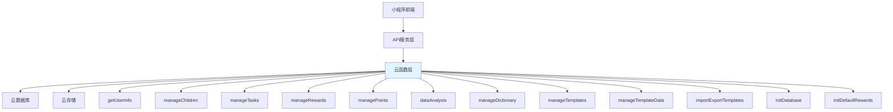

# 云函数实现设计文档

## 1. 概述

本文档详细描述了 StarBloom 儿童积分奖励系统中所有云函数的实现方案。根据项目需求文档，系统包含多个云函数，每个云函数负责特定的业务模块，如用户管理、儿童管理、任务管理、奖励管理、积分系统、数据分析等。

云函数采用统一的设计模式，确保代码风格一致、易于维护，并实现严格的权限控制以保障数据安全。

## 2. 云函数架构

### 2.1 整体架构



### 2.2 云函数设计模式

所有云函数遵循统一的结构设计：

```javascript
// 云函数统一结构
exports.main = async (event, context) => {
  const wxContext = cloud.getWXContext()
  const { action, data } = event
  
  try {
    switch (action) {
      case 'list': return await listItems(data)
      case 'create': return await createItem(data, wxContext.OPENID)
      case 'update': return await updateItem(data)
      case 'delete': return await deleteItem(data)
      default: return { code: -1, message: '未知操作' }
    }
  } catch (error) {
    return handleError(action, error)
  }
}
```

该模式具有以下特点：
- **统一入口**：所有操作通过 `event` 参数传递，包含 `action`（操作类型）和 `data`（请求数据）
- **权限获取**：通过 `cloud.getWXContext()` 获取用户 OpenID，用于权限校验
- **异常处理**：统一的 `try-catch` 机制捕获异常，返回标准化错误信息
- **操作分发**：通过 `switch-case` 分发不同业务操作，逻辑清晰

### 2.3 权限控制机制

系统在云函数层实现严格的权限控制：

```javascript
// 权限验证示例
const checkPermission = (operation, userId, targetData) => {
  switch(operation) {
    case 'create_task':
      return targetData.parentId === userId
    case 'complete_task':
      return targetData.childId === userId || isParent(userId, targetData.childId)
    case 'exchange_reward':
      return isParent(userId, targetData.childId)
    default:
      return false
  }
}
```

## 3. 云函数详细实现

### 3.1 getUserInfo - 用户信息管理

#### 功能描述
管理用户信息，包括获取当前用户信息和更新用户资料。

#### 接口设计
| Action | 功能描述 | 权限要求 |
|--------|----------|----------|
| get | 获取当前用户信息 | 登录用户 |
| update | 更新用户信息 | 用户本人 |

#### 数据库操作
- **集合**: users
- **字段**: 
  - openid (string): 微信用户唯一标识
  - nickName (string): 用户昵称
  - avatarUrl (string): 头像URL
  - isAdmin (boolean): 是否管理员
  - isAdvancedUser (boolean): 是否高级用户
  - createTime (date): 创建时间
  - updateTime (date): 更新时间

#### 业务逻辑
1. 获取用户信息时，根据 openid 查询用户记录
2. 更新用户信息时，验证用户身份并更新相应字段

#### 代码实现
```javascript
// cloudfunctions/getUserInfo/index.js
const cloud = require('wx-server-sdk')
cloud.init({
  env: cloud.DYNAMIC_CURRENT_ENV
})

const db = cloud.database()

exports.main = async (event, context) => {
  const wxContext = cloud.getWXContext()
  const { action, data } = event
  
  try {
    switch (action) {
      case 'get':
        return await getUserInfo(wxContext.OPENID)
      case 'update':
        return await updateUserInfo(wxContext.OPENID, data)
      default:
        return { code: -1, message: '未知操作' }
    }
  } catch (error) {
    console.error('getUserInfo error:', error)
    return { code: -1, message: '系统错误，请稍后重试' }
  }
}

async function getUserInfo(openid) {
  try {
    const result = await db.collection('users').where({
      openid: openid
    }).get()
    
    if (result.data.length > 0) {
      return { code: 0, message: 'success', data: result.data[0] }
    } else {
      // 如果用户不存在，创建新用户
      const newUser = {
        openid: openid,
        nickName: '',
        avatarUrl: '',
        isAdmin: false,
        isAdvancedUser: false,
        createTime: new Date(),
        updateTime: new Date()
      }
      
      const addResult = await db.collection('users').add({
        data: newUser
      })
      
      newUser._id = addResult._id
      return { code: 0, message: 'success', data: newUser }
    }
  } catch (error) {
    console.error('getUserInfo error:', error)
    return { code: -1, message: '获取用户信息失败' }
  }
}

async function updateUserInfo(openid, data) {
  try {
    // 验证用户身份
    const userResult = await db.collection('users').where({
      openid: openid
    }).get()
    
    if (userResult.data.length === 0) {
      return { code: -1, message: '用户不存在' }
    }
    
    // 更新用户信息
    const updateData = {
      nickName: data.nickName || '',
      avatarUrl: data.avatarUrl || '',
      updateTime: new Date()
    }
    
    await db.collection('users').where({
      openid: openid
    }).update({
      data: updateData
    })
    
    return { code: 0, message: '更新成功' }
  } catch (error) {
    console.error('updateUserInfo error:', error)
    return { code: -1, message: '更新用户信息失败' }
  }
}
```

### 3.2 manageChildren - 儿童信息管理

#### 功能描述
管理儿童信息，包括增删改查儿童资料。

#### 接口设计
| Action | 功能描述 | 权限要求 |
|--------|----------|----------|
| list | 获取儿童列表 | 家长用户 |
| create | 创建儿童信息 | 家长用户 |
| update | 更新儿童信息 | 儿童家长 |
| delete | 删除儿童信息 | 儿童家长 |

#### 数据库操作
- **集合**: children
- **字段**:
  - name (string): 儿童姓名
  - age (number): 年龄
  - avatar (string): 头像URL
  - parentId (string): 家长ID (外键 -> users.openid)
  - totalPoints (number): 当前总积分
  - totalEarnedPoints (number): 累计获得积分
  - totalConsumedPoints (number): 累计消耗积分
  - createTime (date): 创建时间
  - updateTime (date): 更新时间

#### 业务逻辑
1. 创建儿童时，设置 parentId 为当前用户 openid
2. 查询、更新、删除操作需验证 parentId 与当前用户是否匹配

#### 代码实现
```javascript
// cloudfunctions/manageChildren/index.js
const cloud = require('wx-server-sdk')
cloud.init({
  env: cloud.DYNAMIC_CURRENT_ENV
})

const db = cloud.database()

exports.main = async (event, context) => {
  const wxContext = cloud.getWXContext()
  const { action, data } = event
  
  try {
    switch (action) {
      case 'list':
        return await getChildrenList(wxContext.OPENID)
      case 'create':
        return await createChild(wxContext.OPENID, data)
      case 'update':
        return await updateChild(wxContext.OPENID, data)
      case 'delete':
        return await deleteChild(wxContext.OPENID, data)
      default:
        return { code: -1, message: '未知操作' }
    }
  } catch (error) {
    console.error('manageChildren error:', error)
    return { code: -1, message: '系统错误，请稍后重试' }
  }
}

async function getChildrenList(parentId) {
  try {
    const result = await db.collection('children').where({
      parentId: parentId
    }).get()
    
    return { code: 0, message: 'success', data: result.data }
  } catch (error) {
    console.error('getChildrenList error:', error)
    return { code: -1, message: '获取儿童列表失败' }
  }
}

async function createChild(parentId, data) {
  try {
    const childData = {
      name: data.name,
      age: data.age || 0,
      avatar: data.avatar || '',
      parentId: parentId,
      totalPoints: 0,
      totalEarnedPoints: 0,
      totalConsumedPoints: 0,
      createTime: new Date(),
      updateTime: new Date()
    }
    
    const result = await db.collection('children').add({
      data: childData
    })
    
    childData._id = result._id
    return { code: 0, message: '创建成功', data: childData }
  } catch (error) {
    console.error('createChild error:', error)
    return { code: -1, message: '创建儿童信息失败' }
  }
}

async function updateChild(parentId, data) {
  try {
    // 验证权限
    const childResult = await db.collection('children').where({
      _id: data._id,
      parentId: parentId
    }).get()
    
    if (childResult.data.length === 0) {
      return { code: -1, message: '权限不足或儿童不存在' }
    }
    
    // 更新儿童信息
    const updateData = {
      name: data.name,
      age: data.age,
      avatar: data.avatar,
      updateTime: new Date()
    }
    
    await db.collection('children').doc(data._id).update({
      data: updateData
    })
    
    return { code: 0, message: '更新成功' }
  } catch (error) {
    console.error('updateChild error:', error)
    return { code: -1, message: '更新儿童信息失败' }
  }
}

async function deleteChild(parentId, data) {
  try {
    // 验证权限
    const childResult = await db.collection('children').where({
      _id: data._id,
      parentId: parentId
    }).get()
    
    if (childResult.data.length === 0) {
      return { code: -1, message: '权限不足或儿童不存在' }
    }
    
    // 删除儿童信息
    await db.collection('children').doc(data._id).remove()
    
    return { code: 0, message: '删除成功' }
  } catch (error) {
    console.error('deleteChild error:', error)
    return { code: -1, message: '删除儿童信息失败' }
  }
}
```

### 3.3 manageTasks - 任务管理

#### 功能描述
管理任务信息，包括任务的增删改查和完成操作。

#### 接口设计
| Action | 功能描述 | 权限要求 |
|--------|----------|----------|
| list | 获取任务列表 | 家长用户 |
| create | 创建任务 | 家长用户 |
| update | 更新任务 | 任务创建者 |
| delete | 删除任务 | 任务创建者 |
| complete | 完成任务 | 儿童家长 |

#### 数据库操作
- **集合**: tasks, task_completion_records
- **tasks 字段**:
  - name (string): 任务名称
  - description (string): 任务描述
  - points (number): 基础积分
  - taskType (string): 任务类型
  - cycleType (string): 任务周期类型
  - status (string): 状态
  - parentId (string): 创建者ID
  - childIds (array): 分配的儿童ID列表
  - createTime (date): 创建时间
  - updateTime (date): 更新时间

#### 业务逻辑
1. 完成任务时需要：
   - 验证任务和儿童的权限关系
   - 创建任务完成记录
   - 更新儿童积分
   - 创建积分记录

#### 代码实现
```javascript
// cloudfunctions/manageTasks/index.js
const cloud = require('wx-server-sdk')
cloud.init({
  env: cloud.DYNAMIC_CURRENT_ENV
})

const db = cloud.database()
const _ = db.command

exports.main = async (event, context) => {
  const wxContext = cloud.getWXContext()
  const { action, data } = event
  
  try {
    switch (action) {
      case 'list':
        return await getTasks(wxContext.OPENID, data)
      case 'create':
        return await createTask(wxContext.OPENID, data)
      case 'update':
        return await updateTask(wxContext.OPENID, data)
      case 'delete':
        return await deleteTask(wxContext.OPENID, data)
      case 'complete':
        return await completeTask(wxContext.OPENID, data)
      default:
        return { code: -1, message: '未知操作' }
    }
  } catch (error) {
    console.error('manageTasks error:', error)
    return { code: -1, message: '系统错误，请稍后重试' }
  }
}

async function getTasks(parentId, filters) {
  try {
    let query = db.collection('tasks').where({
      parentId: parentId
    })
    
    // 应用过滤条件
    if (filters && filters.childId) {
      query = query.where({
        childIds: _.in([filters.childId])
      })
    }
    
    if (filters && filters.status) {
      query = query.where({
        status: filters.status
      })
    }
    
    const result = await query.get()
    
    return { code: 0, message: 'success', data: result.data }
  } catch (error) {
    console.error('getTasks error:', error)
    return { code: -1, message: '获取任务列表失败' }
  }
}

async function createTask(parentId, data) {
  try {
    const taskData = {
      name: data.name,
      description: data.description || '',
      points: data.points || 0,
      taskType: data.taskType || 'daily',
      cycleType: data.cycleType || 'daily',
      status: data.status || 'active',
      parentId: parentId,
      childIds: data.childIds || [],
      createTime: new Date(),
      updateTime: new Date()
    }
    
    const result = await db.collection('tasks').add({
      data: taskData
    })
    
    taskData._id = result._id
    return { code: 0, message: '创建成功', data: taskData }
  } catch (error) {
    console.error('createTask error:', error)
    return { code: -1, message: '创建任务失败' }
  }
}

async function updateTask(parentId, data) {
  try {
    // 验证权限
    const taskResult = await db.collection('tasks').where({
      _id: data._id,
      parentId: parentId
    }).get()
    
    if (taskResult.data.length === 0) {
      return { code: -1, message: '权限不足或任务不存在' }
    }
    
    // 更新任务信息
    const updateData = {
      name: data.name,
      description: data.description,
      points: data.points,
      taskType: data.taskType,
      cycleType: data.cycleType,
      status: data.status,
      childIds: data.childIds,
      updateTime: new Date()
    }
    
    await db.collection('tasks').doc(data._id).update({
      data: updateData
    })
    
    return { code: 0, message: '更新成功' }
  } catch (error) {
    console.error('updateTask error:', error)
    return { code: -1, message: '更新任务失败' }
  }
}

async function deleteTask(parentId, data) {
  try {
    // 验证权限
    const taskResult = await db.collection('tasks').where({
      _id: data._id,
      parentId: parentId
    }).get()
    
    if (taskResult.data.length === 0) {
      return { code: -1, message: '权限不足或任务不存在' }
    }
    
    // 删除任务
    await db.collection('tasks').doc(data._id).remove()
    
    return { code: 0, message: '删除成功' }
  } catch (error) {
    console.error('deleteTask error:', error)
    return { code: -1, message: '删除任务失败' }
  }
}

async function completeTask(parentId, data) {
  try {
    const { taskId, childId } = data
    
    // 验证任务权限
    const taskResult = await db.collection('tasks').where({
      _id: taskId,
      parentId: parentId
    }).get()
    
    if (taskResult.data.length === 0) {
      return { code: -1, message: '权限不足或任务不存在' }
    }
    
    const task = taskResult.data[0]
    
    // 验证儿童权限
    if (!task.childIds.includes(childId)) {
      return { code: -1, message: '该任务未分配给此儿童' }
    }
    
    // 检查是否已经完成
    const recordResult = await db.collection('task_completion_records').where({
      taskId: taskId,
      childId: childId,
      completeDate: _.gte(new Date(new Date().setHours(0, 0, 0, 0)))
    }).get()
    
    if (recordResult.data.length > 0) {
      return { code: -1, message: '今日任务已完成' }
    }
    
    // 创建任务完成记录
    const completionRecord = {
      taskId: taskId,
      childId: childId,
      completeDate: new Date(),
      status: 'completed',
      pointsEarned: task.points,
      createBy: parentId,
      createTime: new Date(),
      updateTime: new Date()
    }
    
    await db.collection('task_completion_records').add({
      data: completionRecord
    })
    
    // 更新儿童积分
    await db.collection('children').doc(childId).update({
      data: {
        totalPoints: _.inc(task.points),
        totalEarnedPoints: _.inc(task.points),
        updateTime: new Date()
      }
    })
    
    // 创建积分记录
    const pointRecord = {
      childId: childId,
      points: task.points,
      changeType: 'earn',
      reason: `完成任务: ${task.name}`,
      sourceType: 'task',
      recordTime: new Date(),
      createTime: new Date(),
      createBy: parentId
    }
    
    await db.collection('point_records').add({
      data: pointRecord
    })
    
    return { code: 0, message: '任务完成成功', data: { points: task.points } }
  } catch (error) {
    console.error('completeTask error:', error)
    return { code: -1, message: '完成任务失败' }
  }
}
```

### 3.4 manageRewards - 奖励管理

#### 功能描述
管理奖励信息，包括奖励的增删改查和兑换操作。

#### 接口设计
| Action | 功能描述 | 权限要求 |
|--------|----------|----------|
| list | 获取奖励列表 | 家长用户 |
| create | 创建奖励 | 家长用户 |
| update | 更新奖励 | 奖励创建者 |
| delete | 删除奖励 | 奖励创建者 |
| exchange | 兑换奖励 | 儿童家长 |

#### 数据库操作
- **集合**: rewards, exchange_records
- **rewards 字段**:
  - name (string): 奖励名称
  - description (string): 奖励描述
  - pointsRequired (number): 所需积分
  - rewardType (string): 奖励类型
  - stock (number): 库存数量
  - status (string): 状态
  - parentId (string): 创建者ID
  - createTime (date): 创建时间
  - updateTime (date): 更新时间

#### 业务逻辑
1. 兑换奖励时需要：
   - 验证儿童积分是否足够
   - 检查奖励库存
   - 扣减儿童积分
   - 更新奖励库存
   - 创建兑换记录
   - 创建积分记录

#### 代码实现
```javascript
// cloudfunctions/manageRewards/index.js
const cloud = require('wx-server-sdk')
cloud.init({
  env: cloud.DYNAMIC_CURRENT_ENV
})

const db = cloud.database()
const _ = db.command

exports.main = async (event, context) => {
  const wxContext = cloud.getWXContext()
  const { action, data } = event
  
  try {
    switch (action) {
      case 'list':
        return await getRewards(wxContext.OPENID, data)
      case 'create':
        return await createReward(wxContext.OPENID, data)
      case 'update':
        return await updateReward(wxContext.OPENID, data)
      case 'delete':
        return await deleteReward(wxContext.OPENID, data)
      case 'exchange':
        return await exchangeReward(wxContext.OPENID, data)
      default:
        return { code: -1, message: '未知操作' }
    }
  } catch (error) {
    console.error('manageRewards error:', error)
    return { code: -1, message: '系统错误，请稍后重试' }
  }
}

async function getRewards(parentId, filters) {
  try {
    let query = db.collection('rewards').where({
      parentId: parentId
    })
    
    // 应用过滤条件
    if (filters && filters.status) {
      query = query.where({
        status: filters.status
      })
    }
    
    const result = await query.get()
    
    return { code: 0, message: 'success', data: result.data }
  } catch (error) {
    console.error('getRewards error:', error)
    return { code: -1, message: '获取奖励列表失败' }
  }
}

async function createReward(parentId, data) {
  try {
    const rewardData = {
      name: data.name,
      description: data.description || '',
      pointsRequired: data.pointsRequired || 0,
      rewardType: data.rewardType || 'physical',
      stock: data.stock || 0,
      status: data.status || 'active',
      parentId: parentId,
      createTime: new Date(),
      updateTime: new Date()
    }
    
    const result = await db.collection('rewards').add({
      data: rewardData
    })
    
    rewardData._id = result._id
    return { code: 0, message: '创建成功', data: rewardData }
  } catch (error) {
    console.error('createReward error:', error)
    return { code: -1, message: '创建奖励失败' }
  }
}

async function updateReward(parentId, data) {
  try {
    // 验证权限
    const rewardResult = await db.collection('rewards').where({
      _id: data._id,
      parentId: parentId
    }).get()
    
    if (rewardResult.data.length === 0) {
      return { code: -1, message: '权限不足或奖励不存在' }
    }
    
    // 更新奖励信息
    const updateData = {
      name: data.name,
      description: data.description,
      pointsRequired: data.pointsRequired,
      rewardType: data.rewardType,
      stock: data.stock,
      status: data.status,
      updateTime: new Date()
    }
    
    await db.collection('rewards').doc(data._id).update({
      data: updateData
    })
    
    return { code: 0, message: '更新成功' }
  } catch (error) {
    console.error('updateReward error:', error)
    return { code: -1, message: '更新奖励失败' }
  }
}

async function deleteReward(parentId, data) {
  try {
    // 验证权限
    const rewardResult = await db.collection('rewards').where({
      _id: data._id,
      parentId: parentId
    }).get()
    
    if (rewardResult.data.length === 0) {
      return { code: -1, message: '权限不足或奖励不存在' }
    }
    
    // 删除奖励
    await db.collection('rewards').doc(data._id).remove()
    
    return { code: 0, message: '删除成功' }
  } catch (error) {
    console.error('deleteReward error:', error)
    return { code: -1, message: '删除奖励失败' }
  }
}

async function exchangeReward(parentId, data) {
  try {
    const { rewardId, childId } = data
    
    // 获取奖励信息
    const rewardResult = await db.collection('rewards').doc(rewardId).get()
    
    if (!rewardResult.data) {
      return { code: -1, message: '奖励不存在' }
    }
    
    const reward = rewardResult.data
    
    // 验证奖励状态
    if (reward.status !== 'active') {
      return { code: -1, message: '奖励已停用' }
    }
    
    // 获取儿童信息
    const childResult = await db.collection('children').doc(childId).get()
    
    if (!childResult.data) {
      return { code: -1, message: '儿童不存在' }
    }
    
    const child = childResult.data
    
    // 验证权限
    if (child.parentId !== parentId) {
      return { code: -1, message: '权限不足' }
    }
    
    // 验证积分是否足够
    if (child.totalPoints < reward.pointsRequired) {
      return { code: -1, message: '积分不足' }
    }
    
    // 验证库存
    if (reward.stock <= 0) {
      return { code: -1, message: '库存不足' }
    }
    
    // 开始事务处理
    const transaction = await db.startTransaction()
    
    try {
      // 扣减儿童积分
      await transaction.collection('children').doc(childId).update({
        data: {
          totalPoints: _.inc(-reward.pointsRequired),
          totalConsumedPoints: _.inc(reward.pointsRequired),
          updateTime: new Date()
        }
      })
      
      // 更新奖励库存
      await transaction.collection('rewards').doc(rewardId).update({
        data: {
          stock: _.inc(-1),
          updateTime: new Date()
        }
      })
      
      // 创建兑换记录
      const exchangeRecord = {
        rewardId: rewardId,
        childId: childId,
        pointsUsed: reward.pointsRequired,
        exchangeTime: new Date(),
        status: 'pending',
        parentId: parentId,
        _openid: parentId,
        createTime: new Date()
      }
      
      await transaction.collection('exchange_records').add({
        data: exchangeRecord
      })
      
      // 创建积分记录
      const pointRecord = {
        childId: childId,
        points: -reward.pointsRequired,
        changeType: 'consume',
        reason: `兑换奖励: ${reward.name}`,
        sourceType: 'exchange',
        recordTime: new Date(),
        createTime: new Date(),
        createBy: parentId
      }
      
      await transaction.collection('point_records').add({
        data: pointRecord
      })
      
      // 提交事务
      await transaction.commit()
      
      return { code: 0, message: '兑换申请提交成功', data: exchangeRecord }
    } catch (error) {
      // 回滚事务
      await transaction.rollback()
      throw error
    }
  } catch (error) {
    console.error('exchangeReward error:', error)
    return { code: -1, message: '兑换奖励失败' }
  }
}
```

### 3.5 managePoints - 积分系统管理

#### 功能描述
管理积分信息，包括积分记录查询和积分调整。

#### 接口设计
| Action | 功能描述 | 权限要求 |
|--------|----------|----------|
| list | 获取积分记录 | 家长用户 |
| add | 增加积分 | 家长用户 |
| subtract | 扣减积分 | 家长用户 |
| balance | 获取积分余额 | 家长用户 |

#### 数据库操作
- **集合**: point_records, children
- **point_records 字段**:
  - childId (string): 儿童ID
  - points (number): 积分变动
  - changeType (string): 变动类型
  - reason (string): 变动原因
  - sourceType (string): 来源类型
  - recordTime (date): 记录时间
  - createTime (date): 创建时间
  - createBy (string): 创建者openid

#### 业务逻辑
1. 调整积分时需要：
   - 更新儿童积分余额
   - 创建积分记录
   - 根据调整类型设置相应的 changeType 和 sourceType

#### 代码实现
```javascript
// cloudfunctions/managePoints/index.js
const cloud = require('wx-server-sdk')
cloud.init({
  env: cloud.DYNAMIC_CURRENT_ENV
})

const db = cloud.database()
const _ = db.command

exports.main = async (event, context) => {
  const wxContext = cloud.getWXContext()
  const { action, data } = event
  
  try {
    switch (action) {
      case 'list':
        return await getPointRecords(wxContext.OPENID, data)
      case 'add':
        return await addPoints(wxContext.OPENID, data)
      case 'subtract':
        return await subtractPoints(wxContext.OPENID, data)
      case 'balance':
        return await getPointBalance(wxContext.OPENID, data)
      default:
        return { code: -1, message: '未知操作' }
    }
  } catch (error) {
    console.error('managePoints error:', error)
    return { code: -1, message: '系统错误，请稍后重试' }
  }
}

async function getPointRecords(parentId, filters) {
  try {
    // 验证儿童权限
    const childResult = await db.collection('children').where({
      _id: filters.childId,
      parentId: parentId
    }).get()
    
    if (childResult.data.length === 0) {
      return { code: -1, message: '权限不足或儿童不存在' }
    }
    
    let query = db.collection('point_records').where({
      childId: filters.childId
    })
    
    // 应用过滤条件
    if (filters && filters.changeType) {
      query = query.where({
        changeType: filters.changeType
      })
    }
    
    // 按时间倒序排列
    query = query.orderBy('recordTime', 'desc')
    
    // 分页处理
    if (filters && filters.page && filters.limit) {
      query = query.skip((filters.page - 1) * filters.limit).limit(filters.limit)
    }
    
    const result = await query.get()
    
    return { code: 0, message: 'success', data: result.data }
  } catch (error) {
    console.error('getPointRecords error:', error)
    return { code: -1, message: '获取积分记录失败' }
  }
}

async function addPoints(parentId, data) {
  try {
    const { childId, points, reason } = data
    
    // 验证儿童权限
    const childResult = await db.collection('children').where({
      _id: childId,
      parentId: parentId
    }).get()
    
    if (childResult.data.length === 0) {
      return { code: -1, message: '权限不足或儿童不存在' }
    }
    
    // 更新儿童积分
    await db.collection('children').doc(childId).update({
      data: {
        totalPoints: _.inc(points),
        totalEarnedPoints: _.inc(points),
        updateTime: new Date()
      }
    })
    
    // 创建积分记录
    const pointRecord = {
      childId: childId,
      points: points,
      changeType: 'adjustment_add',
      reason: reason || '积分调整(增加)',
      sourceType: 'adjustment',
      recordTime: new Date(),
      createTime: new Date(),
      createBy: parentId
    }
    
    const result = await db.collection('point_records').add({
      data: pointRecord
    })
    
    pointRecord._id = result._id
    return { code: 0, message: '积分增加成功', data: pointRecord }
  } catch (error) {
    console.error('addPoints error:', error)
    return { code: -1, message: '积分增加失败' }
  }
}

async function subtractPoints(parentId, data) {
  try {
    const { childId, points, reason } = data
    
    // 验证儿童权限
    const childResult = await db.collection('children').where({
      _id: childId,
      parentId: parentId
    }).get()
    
    if (childResult.data.length === 0) {
      return { code: -1, message: '权限不足或儿童不存在' }
    }
    
    const child = childResult.data[0]
    
    // 验证积分是否足够
    if (child.totalPoints < points) {
      return { code: -1, message: '积分不足' }
    }
    
    // 更新儿童积分
    await db.collection('children').doc(childId).update({
      data: {
        totalPoints: _.inc(-points),
        totalConsumedPoints: _.inc(points),
        updateTime: new Date()
      }
    })
    
    // 创建积分记录
    const pointRecord = {
      childId: childId,
      points: -points,
      changeType: 'adjustment_subtract',
      reason: reason || '积分调整(减少)',
      sourceType: 'adjustment',
      recordTime: new Date(),
      createTime: new Date(),
      createBy: parentId
    }
    
    const result = await db.collection('point_records').add({
      data: pointRecord
    })
    
    pointRecord._id = result._id
    return { code: 0, message: '积分扣减成功', data: pointRecord }
  } catch (error) {
    console.error('subtractPoints error:', error)
    return { code: -1, message: '积分扣减失败' }
  }
}

async function getPointBalance(parentId, data) {
  try {
    const { childId } = data
    
    // 验证儿童权限
    const childResult = await db.collection('children').where({
      _id: childId,
      parentId: parentId
    }).get()
    
    if (childResult.data.length === 0) {
      return { code: -1, message: '权限不足或儿童不存在' }
    }
    
    const child = childResult.data[0]
    
    return { code: 0, message: 'success', data: { balance: child.totalPoints } }
  } catch (error) {
    console.error('getPointBalance error:', error)
    return { code: -1, message: '获取积分余额失败' }
  }
}
```

### 3.6 dataAnalysis - 数据分析

#### 功能描述
提供数据分析功能，包括任务统计、积分统计、奖励统计等。

#### 接口设计
| Action | 功能描述 | 权限要求 |
|--------|----------|----------|
| taskStats | 任务统计 | 家长用户 |
| pointStats | 积分统计 | 家长用户 |
| rewardStats | 奖励统计 | 家长用户 |
| childStats | 儿童统计 | 家长用户 |

#### 数据库操作
- **集合**: tasks, task_completion_records, point_records, rewards, exchange_records, children
- **查询逻辑**: 根据不同统计需求，聚合相关数据

#### 业务逻辑
1. 任务统计：统计任务完成情况、完成率等
2. 积分统计：统计积分获得、消耗情况
3. 奖励统计：统计奖励兑换情况
4. 儿童统计：综合统计儿童的各项数据

#### 代码实现
```javascript
// cloudfunctions/dataAnalysis/index.js
const cloud = require('wx-server-sdk')
cloud.init({
  env: cloud.DYNAMIC_CURRENT_ENV
})

const db = cloud.database()

exports.main = async (event, context) => {
  const wxContext = cloud.getWXContext()
  const { action, data } = event
  
  try {
    switch (action) {
      case 'taskStats':
        return await getTaskStatistics(wxContext.OPENID, data)
      case 'pointStats':
        return await getPointStatistics(wxContext.OPENID, data)
      case 'rewardStats':
        return await getRewardStatistics(wxContext.OPENID, data)
      case 'childStats':
        return await getChildStatistics(wxContext.OPENID, data)
      default:
        return { code: -1, message: '未知操作' }
    }
  } catch (error) {
    console.error('dataAnalysis error:', error)
    return { code: -1, message: '系统错误，请稍后重试' }
  }
}

async function getTaskStatistics(parentId, filters) {
  try {
    const { childId, startDate, endDate } = filters || {}
    
    // 构建查询条件
    let taskQuery = db.collection('tasks').where({
      parentId: parentId
    })
    
    if (childId) {
      taskQuery = taskQuery.where({
        childIds: db.command.in([childId])
      })
    }
    
    const tasks = await taskQuery.get()
    const taskIds = tasks.data.map(task => task._id)
    
    // 查询任务完成记录
    let recordQuery = db.collection('task_completion_records').where({
      taskId: db.command.in(taskIds)
    })
    
    if (childId) {
      recordQuery = recordQuery.where({
        childId: childId
      })
    }
    
    if (startDate && endDate) {
      recordQuery = recordQuery.where({
        completeDate: db.command.and([
          db.command.gte(new Date(startDate)),
          db.command.lte(new Date(endDate))
        ])
      })
    }
    
    const records = await recordQuery.get()
    
    // 统计数据
    const totalTasks = tasks.data.length
    const completedTasks = records.data.length
    
    // 按任务类型统计
    const taskTypeStats = {}
    tasks.data.forEach(task => {
      if (!taskTypeStats[task.taskType]) {
        taskTypeStats[task.taskType] = { total: 0, completed: 0 }
      }
      taskTypeStats[task.taskType].total++
      
      // 计算已完成的任务
      const completedRecords = records.data.filter(record => record.taskId === task._id)
      if (completedRecords.length > 0) {
        taskTypeStats[task.taskType].completed++
      }
    })
    
    const stats = {
      totalTasks,
      completedTasks,
      completionRate: totalTasks > 0 ? (completedTasks / totalTasks * 100).toFixed(2) : 0,
      taskTypeStats
    }
    
    return { code: 0, message: 'success', data: stats }
  } catch (error) {
    console.error('getTaskStatistics error:', error)
    return { code: -1, message: '获取任务统计失败' }
  }
}

async function getPointStatistics(parentId, filters) {
  try {
    const { childId, startDate, endDate } = filters || {}
    
    // 查询积分记录
    let recordQuery = db.collection('point_records')
    
    if (childId) {
      recordQuery = recordQuery.where({
        childId: childId
      })
    }
    
    if (startDate && endDate) {
      recordQuery = recordQuery.where({
        recordTime: db.command.and([
          db.command.gte(new Date(startDate)),
          db.command.lte(new Date(endDate))
        ])
      })
    }
    
    const records = await recordQuery.get()
    
    // 统计数据
    let totalEarned = 0
    let totalConsumed = 0
    
    records.data.forEach(record => {
      if (record.points > 0) {
        totalEarned += record.points
      } else {
        totalConsumed += Math.abs(record.points)
      }
    })
    
    // 按变更类型统计
    const changeTypeStats = {}
    records.data.forEach(record => {
      if (!changeTypeStats[record.changeType]) {
        changeTypeStats[record.changeType] = { earned: 0, consumed: 0 }
      }
      
      if (record.points > 0) {
        changeTypeStats[record.changeType].earned += record.points
      } else {
        changeTypeStats[record.changeType].consumed += Math.abs(record.points)
      }
    })
    
    const stats = {
      totalEarned,
      totalConsumed,
      netPoints: totalEarned - totalConsumed,
      changeTypeStats
    }
    
    return { code: 0, message: 'success', data: stats }
  } catch (error) {
    console.error('getPointStatistics error:', error)
    return { code: -1, message: '获取积分统计失败' }
  }
}

async function getRewardStatistics(parentId, filters) {
  try {
    const { childId, startDate, endDate } = filters || {}
    
    // 查询奖励
    let rewardQuery = db.collection('rewards').where({
      parentId: parentId
    })
    
    const rewards = await rewardQuery.get()
    const rewardIds = rewards.data.map(reward => reward._id)
    
    // 查询兑换记录
    let exchangeQuery = db.collection('exchange_records').where({
      rewardId: db.command.in(rewardIds)
    })
    
    if (childId) {
      exchangeQuery = exchangeQuery.where({
        childId: childId
      })
    }
    
    if (startDate && endDate) {
      exchangeQuery = exchangeQuery.where({
        exchangeTime: db.command.and([
          db.command.gte(new Date(startDate)),
          db.command.lte(new Date(endDate))
        ])
      })
    }
    
    const exchanges = await exchangeQuery.get()
    
    // 统计数据
    const totalRewards = rewards.data.length
    const totalExchanges = exchanges.data.length
    
    // 按奖励类型统计
    const rewardTypeStats = {}
    rewards.data.forEach(reward => {
      if (!rewardTypeStats[reward.rewardType]) {
        rewardTypeStats[reward.rewardType] = { total: 0, exchanged: 0 }
      }
      rewardTypeStats[reward.rewardType].total++
      
      // 计算已兑换的奖励
      const exchangedRecords = exchanges.data.filter(exchange => exchange.rewardId === reward._id)
      rewardTypeStats[reward.rewardType].exchanged += exchangedRecords.length
    })
    
    const stats = {
      totalRewards,
      totalExchanges,
      exchangeRate: totalRewards > 0 ? (totalExchanges / totalRewards * 100).toFixed(2) : 0,
      rewardTypeStats
    }
    
    return { code: 0, message: 'success', data: stats }
  } catch (error) {
    console.error('getRewardStatistics error:', error)
    return { code: -1, message: '获取奖励统计失败' }
  }
}

async function getChildStatistics(parentId, filters) {
  try {
    const { childId } = filters || {}
    
    // 验证儿童权限
    const childResult = await db.collection('children').where({
      _id: childId,
      parentId: parentId
    }).get()
    
    if (childResult.data.length === 0) {
      return { code: -1, message: '权限不足或儿童不存在' }
    }
    
    const child = childResult.data[0]
    
    // 获取任务统计
    const taskStats = await getTaskStatistics(parentId, { childId })
    
    // 获取积分统计
    const pointStats = await getPointStatistics(parentId, { childId })
    
    // 获取奖励统计
    const rewardStats = await getRewardStatistics(parentId, { childId })
    
    const stats = {
      childInfo: {
        name: child.name,
        age: child.age,
        totalPoints: child.totalPoints,
        totalEarnedPoints: child.totalEarnedPoints,
        totalConsumedPoints: child.totalConsumedPoints
      },
      taskStats: taskStats.data,
      pointStats: pointStats.data,
      rewardStats: rewardStats.data
    }
    
    return { code: 0, message: 'success', data: stats }
  } catch (error) {
    console.error('getChildStatistics error:', error)
    return { code: -1, message: '获取儿童统计失败' }
  }
}
```

### 3.7 manageDictionary - 字典管理

#### 功能描述
管理系统字典数据，包括任务类型、奖励类型等配置信息。

#### 接口设计
| Action | 功能描述 | 权限要求 |
|--------|----------|----------|
| list | 获取字典列表 | 登录用户 |
| create | 创建字典项 | 管理员 |
| update | 更新字典项 | 管理员 |
| delete | 删除字典项 | 管理员 |

#### 数据库操作
- **集合**: dictionaries
- **字段**:
  - category (string): 字典分类
  - code (string): 字典编码
  - name (string): 显示名称
  - value (any): 字典值
  - is_active (boolean): 是否启用
  - create_time (date): 创建时间
  - update_time (date): 更新时间

#### 业务逻辑
1. 字典数据主要用于前端下拉选项和配置
2. 只有管理员可以修改字典数据

#### 代码实现
```javascript
// cloudfunctions/manageDictionary/index.js
const cloud = require('wx-server-sdk')
cloud.init({
  env: cloud.DYNAMIC_CURRENT_ENV
})

const db = cloud.database()

exports.main = async (event, context) => {
  const wxContext = cloud.getWXContext()
  const { action, data } = event
  
  try {
    switch (action) {
      case 'list':
        return await getDictionaryList(data)
      case 'create':
        return await createDictionary(wxContext.OPENID, data)
      case 'update':
        return await updateDictionary(wxContext.OPENID, data)
      case 'delete':
        return await deleteDictionary(wxContext.OPENID, data)
      default:
        return { code: -1, message: '未知操作' }
    }
  } catch (error) {
    console.error('manageDictionary error:', error)
    return { code: -1, message: '系统错误，请稍后重试' }
  }
}

async function getDictionaryList(filters) {
  try {
    let query = db.collection('dictionaries')
    
    // 应用过滤条件
    if (filters && filters.category) {
      query = query.where({
        category: filters.category
      })
    }
    
    if (filters && filters.is_active !== undefined) {
      query = query.where({
        is_active: filters.is_active
      })
    }
    
    // 按分类和名称排序
    query = query.orderBy('category', 'asc').orderBy('name', 'asc')
    
    const result = await query.get()
    
    return { code: 0, message: 'success', data: result.data }
  } catch (error) {
    console.error('getDictionaryList error:', error)
    return { code: -1, message: '获取字典列表失败' }
  }
}

async function createDictionary(openid, data) {
  try {
    // 验证用户是否为管理员
    const userResult = await db.collection('users').where({
      openid: openid
    }).get()
    
    if (userResult.data.length === 0 || !userResult.data[0].isAdmin) {
      return { code: -1, message: '权限不足' }
    }
    
    const dictionaryData = {
      category: data.category,
      code: data.code,
      name: data.name,
      value: data.value,
      is_active: data.is_active !== undefined ? data.is_active : true,
      create_time: new Date(),
      update_time: new Date()
    }
    
    const result = await db.collection('dictionaries').add({
      data: dictionaryData
    })
    
    dictionaryData._id = result._id
    return { code: 0, message: '创建成功', data: dictionaryData }
  } catch (error) {
    console.error('createDictionary error:', error)
    return { code: -1, message: '创建字典项失败' }
  }
}

async function updateDictionary(openid, data) {
  try {
    // 验证用户是否为管理员
    const userResult = await db.collection('users').where({
      openid: openid
    }).get()
    
    if (userResult.data.length === 0 || !userResult.data[0].isAdmin) {
      return { code: -1, message: '权限不足' }
    }
    
    // 更新字典项
    const updateData = {
      category: data.category,
      code: data.code,
      name: data.name,
      value: data.value,
      is_active: data.is_active,
      update_time: new Date()
    }
    
    await db.collection('dictionaries').doc(data._id).update({
      data: updateData
    })
    
    return { code: 0, message: '更新成功' }
  } catch (error) {
    console.error('updateDictionary error:', error)
    return { code: -1, message: '更新字典项失败' }
  }
}

async function deleteDictionary(openid, data) {
  try {
    // 验证用户是否为管理员
    const userResult = await db.collection('users').where({
      openid: openid
    }).get()
    
    if (userResult.data.length === 0 || !userResult.data[0].isAdmin) {
      return { code: -1, message: '权限不足' }
    }
    
    // 删除字典项
    await db.collection('dictionaries').doc(data._id).remove()
    
    return { code: 0, message: '删除成功' }
  } catch (error) {
    console.error('deleteDictionary error:', error)
    return { code: -1, message: '删除字典项失败' }
  }
}
```

### 3.8 manageTemplates - 预设模板管理

#### 功能描述
管理预设模板，包括任务模板和奖励模板。

#### 接口设计
| Action | 功能描述 | 权限要求 |
|--------|----------|----------|
| list | 获取模板列表 | 登录用户 |
| create | 创建模板 | 管理员/高级用户 |
| update | 更新模板 | 模板创建者 |
| delete | 删除模板 | 模板创建者 |
| apply | 应用模板 | 家长用户 |

#### 数据库操作
- **集合**: task_templates, reward_templates
- **task_templates 字段**:
  - templateId (string): 模板唯一标识
  - name (string): 任务名称
  - description (string): 任务描述
  - taskType (string): 任务类型
  - cycleType (string): 任务周期类型
  - points (number): 基础积分
  - habitTags (array): 习惯标签
  - tips (string): 温馨提示
  - difficulty (string): 难度等级
  - ageGroup (string): 适用年龄段
  - ageRange (object): 具体年龄范围
  - category (string): 分类
  - isActive (boolean): 是否启用
  - sort_order (number): 排序权重
  - usage_count (number): 使用次数统计
  - version (number): 模板版本号
  - createBy (string): 创建者
  - createTime (date): 创建时间
  - updateTime (date): 更新时间

#### 业务逻辑
1. 应用模板时，根据模板数据创建实际的任务或奖励记录

#### 代码实现
```javascript
// cloudfunctions/manageTemplates/index.js
const cloud = require('wx-server-sdk')
cloud.init({
  env: cloud.DYNAMIC_CURRENT_ENV
})

const db = cloud.database()

exports.main = async (event, context) => {
  const wxContext = cloud.getWXContext()
  const { action, data } = event
  
  try {
    switch (action) {
      case 'list':
        return await getTemplateList(data)
      case 'create':
        return await createTemplate(wxContext.OPENID, data)
      case 'update':
        return await updateTemplate(wxContext.OPENID, data)
      case 'delete':
        return await deleteTemplate(wxContext.OPENID, data)
      case 'apply':
        return await applyTemplate(wxContext.OPENID, data)
      default:
        return { code: -1, message: '未知操作' }
    }
  } catch (error) {
    console.error('manageTemplates error:', error)
    return { code: -1, message: '系统错误，请稍后重试' }
  }
}

async function getTemplateList(filters) {
  try {
    const { templateType, ageGroup, category, isActive } = filters || {}
    
    let collectionName = 'task_templates'
    if (templateType === 'reward') {
      collectionName = 'reward_templates'
    }
    
    let query = db.collection(collectionName)
    
    // 应用过滤条件
    if (ageGroup) {
      query = query.where({
        ageGroup: ageGroup
      })
    }
    
    if (category) {
      query = query.where({
        category: category
      })
    }
    
    if (isActive !== undefined) {
      query = query.where({
        isActive: isActive
      })
    }
    
    // 只获取启用的模板
    query = query.where({
      isActive: true
    })
    
    // 按排序权重和使用次数排序
    query = query.orderBy('sort_order', 'asc').orderBy('usage_count', 'desc')
    
    const result = await query.get()
    
    return { code: 0, message: 'success', data: result.data }
  } catch (error) {
    console.error('getTemplateList error:', error)
    return { code: -1, message: '获取模板列表失败' }
  }
}

async function createTemplate(openid, data) {
  try {
    const { templateType } = data
    
    // 验证用户权限
    const userResult = await db.collection('users').where({
      openid: openid
    }).get()
    
    if (userResult.data.length === 0) {
      return { code: -1, message: '用户不存在' }
    }
    
    const user = userResult.data[0]
    if (!user.isAdmin && !user.isAdvancedUser) {
      return { code: -1, message: '权限不足' }
    }
    
    let collectionName = 'task_templates'
    if (templateType === 'reward') {
      collectionName = 'reward_templates'
    }
    
    const templateData = {
      templateId: data.templateId || generateTemplateId(),
      name: data.name,
      description: data.description || '',
      taskType: data.taskType || 'daily',
      cycleType: data.cycleType || 'daily',
      points: data.points || 0,
      habitTags: data.habitTags || [],
      tips: data.tips || '',
      difficulty: data.difficulty || 'easy',
      ageGroup: data.ageGroup || 'general',
      ageRange: data.ageRange || {},
      category: data.category || 'general',
      rewardType: data.rewardType || 'physical',
      pointsRequired: data.pointsRequired || 0,
      isActive: data.isActive !== undefined ? data.isActive : true,
      sort_order: data.sort_order || 0,
      usage_count: 0,
      version: 1,
      createBy: openid,
      createTime: new Date(),
      updateTime: new Date()
    }
    
    const result = await db.collection(collectionName).add({
      data: templateData
    })
    
    templateData._id = result._id
    return { code: 0, message: '创建成功', data: templateData }
  } catch (error) {
    console.error('createTemplate error:', error)
    return { code: -1, message: '创建模板失败' }
  }
}

async function updateTemplate(openid, data) {
  try {
    const { templateType } = data
    
    let collectionName = 'task_templates'
    if (templateType === 'reward') {
      collectionName = 'reward_templates'
    }
    
    // 验证权限
    const templateResult = await db.collection(collectionName).where({
      _id: data._id,
      createBy: openid
    }).get()
    
    if (templateResult.data.length === 0) {
      // 检查是否为管理员
      const userResult = await db.collection('users').where({
        openid: openid
      }).get()
      
      if (userResult.data.length === 0 || !userResult.data[0].isAdmin) {
        return { code: -1, message: '权限不足或模板不存在' }
      }
    }
    
    // 更新模板
    const updateData = {
      name: data.name,
      description: data.description,
      taskType: data.taskType,
      cycleType: data.cycleType,
      points: data.points,
      habitTags: data.habitTags,
      tips: data.tips,
      difficulty: data.difficulty,
      ageGroup: data.ageGroup,
      ageRange: data.ageRange,
      category: data.category,
      rewardType: data.rewardType,
      pointsRequired: data.pointsRequired,
      isActive: data.isActive,
      sort_order: data.sort_order,
      updateTime: new Date(),
      version: db.command.inc(1)
    }
    
    await db.collection(collectionName).doc(data._id).update({
      data: updateData
    })
    
    return { code: 0, message: '更新成功' }
  } catch (error) {
    console.error('updateTemplate error:', error)
    return { code: -1, message: '更新模板失败' }
  }
}

async function deleteTemplate(openid, data) {
  try {
    const { templateType } = data
    
    let collectionName = 'task_templates'
    if (templateType === 'reward') {
      collectionName = 'reward_templates'
    }
    
    // 验证权限
    const templateResult = await db.collection(collectionName).where({
      _id: data._id,
      createBy: openid
    }).get()
    
    if (templateResult.data.length === 0) {
      // 检查是否为管理员
      const userResult = await db.collection('users').where({
        openid: openid
      }).get()
      
      if (userResult.data.length === 0 || !userResult.data[0].isAdmin) {
        return { code: -1, message: '权限不足或模板不存在' }
      }
    }
    
    // 删除模板
    await db.collection(collectionName).doc(data._id).remove()
    
    return { code: 0, message: '删除成功' }
  } catch (error) {
    console.error('deleteTemplate error:', error)
    return { code: -1, message: '删除模板失败' }
  }
}

async function applyTemplate(parentId, data) {
  try {
    const { templateId, templateType, childId } = data
    
    let collectionName = 'task_templates'
    if (templateType === 'reward') {
      collectionName = 'reward_templates'
    }
    
    // 获取模板
    const templateResult = await db.collection(collectionName).doc(templateId).get()
    
    if (!templateResult.data) {
      return { code: -1, message: '模板不存在' }
    }
    
    const template = templateResult.data
    
    // 验证模板是否启用
    if (!template.isActive) {
      return { code: -1, message: '模板已停用' }
    }
    
    // 获取儿童信息
    const childResult = await db.collection('children').doc(childId).get()
    
    if (!childResult.data) {
      return { code: -1, message: '儿童不存在' }
    }
    
    const child = childResult.data
    
    // 验证权限
    if (child.parentId !== parentId) {
      return { code: -1, message: '权限不足' }
    }
    
    if (templateType === 'task') {
      // 应用任务模板
      const taskData = {
        name: template.name,
        description: template.description,
        points: template.points,
        taskType: template.taskType,
        cycleType: template.cycleType,
        status: 'active',
        parentId: parentId,
        childIds: [childId],
        createTime: new Date(),
        updateTime: new Date()
      }
      
      const result = await db.collection('tasks').add({
        data: taskData
      })
      
      // 更新模板使用次数
      await db.collection('task_templates').doc(templateId).update({
        data: {
          usage_count: db.command.inc(1),
          updateTime: new Date()
        }
      })
      
      taskData._id = result._id
      return { code: 0, message: '任务创建成功', data: taskData }
    } else {
      // 应用奖励模板
      const rewardData = {
        name: template.name,
        description: template.description,
        pointsRequired: template.pointsRequired,
        rewardType: template.rewardType,
        stock: template.recommendedStock || 999,
        status: 'active',
        parentId: parentId,
        createTime: new Date(),
        updateTime: new Date()
      }
      
      const result = await db.collection('rewards').add({
        data: rewardData
      })
      
      // 更新模板使用次数
      await db.collection('reward_templates').doc(templateId).update({
        data: {
          usage_count: db.command.inc(1),
          updateTime: new Date()
        }
      })
      
      rewardData._id = result._id
      return { code: 0, message: '奖励创建成功', data: rewardData }
    }
  } catch (error) {
    console.error('applyTemplate error:', error)
    return { code: -1, message: '应用模板失败' }
  }
}

function generateTemplateId() {
  return 'template_' + Date.now() + '_' + Math.random().toString(36).substr(2, 9)
}
```

### 3.9 manageTemplateData - 模板数据管理

#### 功能描述
管理模板数据，提供更细粒度的模板管理功能。

#### 接口设计
| Action | 功能描述 | 权限要求 |
|--------|----------|----------|
| list | 获取模板数据列表 | 登录用户 |
| create | 创建模板数据 | 管理员/高级用户 |
| update | 更新模板数据 | 数据创建者 |
| delete | 删除模板数据 | 数据创建者 |
| get | 获取模板数据 | 登录用户 |

#### 数据库操作
- **集合**: task_templates, reward_templates
- **操作**: 与 manageTemplates 类似，但提供更多细粒度操作

#### 代码实现
```javascript
// cloudfunctions/manageTemplateData/index.js
const cloud = require('wx-server-sdk')
cloud.init({
  env: cloud.DYNAMIC_CURRENT_ENV
})

const db = cloud.database()

exports.main = async (event, context) => {
  const wxContext = cloud.getWXContext()
  const { action, data } = event
  
  try {
    switch (action) {
      case 'list':
        return await getTemplateDataList(wxContext.OPENID, data)
      case 'create':
        return await createTemplateData(wxContext.OPENID, data)
      case 'update':
        return await updateTemplateData(wxContext.OPENID, data)
      case 'delete':
        return await deleteTemplateData(wxContext.OPENID, data)
      case 'get':
        return await getTemplateData(wxContext.OPENID, data)
      default:
        return { code: -1, message: '未知操作' }
    }
  } catch (error) {
    console.error('manageTemplateData error:', error)
    return { code: -1, message: '系统错误，请稍后重试' }
  }
}

async function getTemplateDataList(openid, filters) {
  try {
    const { templateType, page, limit, orderBy } = filters || {}
    
    let collectionName = 'task_templates'
    if (templateType === 'reward') {
      collectionName = 'reward_templates'
    }
    
    let query = db.collection(collectionName)
    
    // 分页处理
    if (page && limit) {
      query = query.skip((page - 1) * limit).limit(limit)
    }
    
    // 排序
    if (orderBy) {
      query = query.orderBy(orderBy.field, orderBy.direction || 'asc')
    } else {
      query = query.orderBy('createTime', 'desc')
    }
    
    const result = await query.get()
    
    // 获取总数
    const countResult = await db.collection(collectionName).count()
    
    return { 
      code: 0, 
      message: 'success', 
      data: {
        list: result.data,
        total: countResult.total
      }
    }
  } catch (error) {
    console.error('getTemplateDataList error:', error)
    return { code: -1, message: '获取模板数据列表失败' }
  }
}

async function createTemplateData(openid, data) {
  try {
    const { templateType } = data
    
    // 验证用户权限
    const userResult = await db.collection('users').where({
      openid: openid
    }).get()
    
    if (userResult.data.length === 0) {
      return { code: -1, message: '用户不存在' }
    }
    
    const user = userResult.data[0]
    if (!user.isAdmin && !user.isAdvancedUser) {
      return { code: -1, message: '权限不足' }
    }
    
    let collectionName = 'task_templates'
    if (templateType === 'reward') {
      collectionName = 'reward_templates'
    }
    
    const templateData = {
      templateId: data.templateId || generateTemplateId(),
      name: data.name,
      description: data.description || '',
      taskType: data.taskType || 'daily',
      cycleType: data.cycleType || 'daily',
      points: data.points || 0,
      habitTags: data.habitTags || [],
      tips: data.tips || '',
      difficulty: data.difficulty || 'easy',
      ageGroup: data.ageGroup || 'general',
      ageRange: data.ageRange || {},
      category: data.category || 'general',
      rewardType: data.rewardType || 'physical',
      pointsRequired: data.pointsRequired || 0,
      isActive: data.isActive !== undefined ? data.isActive : true,
      sort_order: data.sort_order || 0,
      usage_count: 0,
      version: 1,
      createBy: openid,
      createTime: new Date(),
      updateTime: new Date()
    }
    
    const result = await db.collection(collectionName).add({
      data: templateData
    })
    
    templateData._id = result._id
    return { code: 0, message: '创建成功', data: templateData }
  } catch (error) {
    console.error('createTemplateData error:', error)
    return { code: -1, message: '创建模板数据失败' }
  }
}

async function updateTemplateData(openid, data) {
  try {
    const { templateType } = data
    
    let collectionName = 'task_templates'
    if (templateType === 'reward') {
      collectionName = 'reward_templates'
    }
    
    // 验证权限
    const templateResult = await db.collection(collectionName).where({
      _id: data._id,
      createBy: openid
    }).get()
    
    if (templateResult.data.length === 0) {
      // 检查是否为管理员
      const userResult = await db.collection('users').where({
        openid: openid
      }).get()
      
      if (userResult.data.length === 0 || !userResult.data[0].isAdmin) {
        return { code: -1, message: '权限不足或模板不存在' }
      }
    }
    
    // 更新模板数据
    const updateData = {
      name: data.name,
      description: data.description,
      taskType: data.taskType,
      cycleType: data.cycleType,
      points: data.points,
      habitTags: data.habitTags,
      tips: data.tips,
      difficulty: data.difficulty,
      ageGroup: data.ageGroup,
      ageRange: data.ageRange,
      category: data.category,
      rewardType: data.rewardType,
      pointsRequired: data.pointsRequired,
      isActive: data.isActive,
      sort_order: data.sort_order,
      updateTime: new Date(),
      version: db.command.inc(1)
    }
    
    await db.collection(collectionName).doc(data._id).update({
      data: updateData
    })
    
    return { code: 0, message: '更新成功' }
  } catch (error) {
    console.error('updateTemplateData error:', error)
    return { code: -1, message: '更新模板数据失败' }
  }
}

async function deleteTemplateData(openid, data) {
  try {
    const { templateType } = data
    
    let collectionName = 'task_templates'
    if (templateType === 'reward') {
      collectionName = 'reward_templates'
    }
    
    // 验证权限
    const templateResult = await db.collection(collectionName).where({
      _id: data._id,
      createBy: openid
    }).get()
    
    if (templateResult.data.length === 0) {
      // 检查是否为管理员
      const userResult = await db.collection('users').where({
        openid: openid
      }).get()
      
      if (userResult.data.length === 0 || !userResult.data[0].isAdmin) {
        return { code: -1, message: '权限不足或模板不存在' }
      }
    }
    
    // 删除模板数据
    await db.collection(collectionName).doc(data._id).remove()
    
    return { code: 0, message: '删除成功' }
  } catch (error) {
    console.error('deleteTemplateData error:', error)
    return { code: -1, message: '删除模板数据失败' }
  }
}

async function getTemplateData(openid, data) {
  try {
    const { templateId, templateType } = data
    
    let collectionName = 'task_templates'
    if (templateType === 'reward') {
      collectionName = 'reward_templates'
    }
    
    const result = await db.collection(collectionName).doc(templateId).get()
    
    if (!result.data) {
      return { code: -1, message: '模板数据不存在' }
    }
    
    return { code: 0, message: 'success', data: result.data }
  } catch (error) {
    console.error('getTemplateData error:', error)
    return { code: -1, message: '获取模板数据失败' }
  }
}

function generateTemplateId() {
  return 'template_' + Date.now() + '_' + Math.random().toString(36).substr(2, 9)
}
```

### 3.10 importExportTemplates - 模板导入导出功能

#### 功能描述
提供模板的导入导出功能。

#### 接口设计
| Action | 功能描述 | 权限要求 |
|--------|----------|----------|
| import | 导入模板 | 管理员/高级用户 |
| export | 导出模板 | 管理员/高级用户 |
| list | 获取导入导出记录 | 管理员/高级用户 |

#### 数据库操作
- **集合**: template_import_export_records
- **字段**:
  - operationType (string): 操作类型
  - fileType (string): 文件类型
  - fileName (string): 文件名
  - recordCount (number): 记录数量
  - operatedBy (string): 操作人ID
  - status (string): 状态
  - errorMsg (string): 错误信息
  - createTime (date): 创建时间

#### 业务逻辑
1. 导入时需要解析文件内容并创建模板记录
2. 导出时需要将模板数据转换为文件格式

#### 代码实现
```javascript
// cloudfunctions/importExportTemplates/index.js
const cloud = require('wx-server-sdk')
cloud.init({
  env: cloud.DYNAMIC_CURRENT_ENV
})

const db = cloud.database()

exports.main = async (event, context) => {
  const wxContext = cloud.getWXContext()
  const { action, data } = event
  
  try {
    switch (action) {
      case 'import':
        return await importTemplates(wxContext.OPENID, data)
      case 'export':
        return await exportTemplates(wxContext.OPENID, data)
      case 'list':
        return await getImportExportRecords(wxContext.OPENID, data)
      default:
        return { code: -1, message: '未知操作' }
    }
  } catch (error) {
    console.error('importExportTemplates error:', error)
    return { code: -1, message: '系统错误，请稍后重试' }
  }
}

async function importTemplates(openid, data) {
  try {
    // 验证用户权限
    const userResult = await db.collection('users').where({
      openid: openid
    }).get()
    
    if (userResult.data.length === 0) {
      return { code: -1, message: '用户不存在' }
    }
    
    const user = userResult.data[0]
    if (!user.isAdmin && !user.isAdvancedUser) {
      return { code: -1, message: '权限不足' }
    }
    
    // 解析导入数据（这里假设数据已通过前端解析并传入）
    const { templates, templateType, fileType } = data
    
    if (!templates || !Array.isArray(templates)) {
      return { code: -1, message: '导入数据格式错误' }
    }
    
    let collectionName = 'task_templates'
    if (templateType === 'reward') {
      collectionName = 'reward_templates'
    }
    
    let successCount = 0
    let errorCount = 0
    const errorMessages = []
    
    // 批量导入模板
    for (const template of templates) {
      try {
        const templateData = {
          templateId: template.templateId || generateTemplateId(),
          name: template.name,
          description: template.description || '',
          taskType: template.taskType || 'daily',
          cycleType: template.cycleType || 'daily',
          points: template.points || 0,
          habitTags: template.habitTags || [],
          tips: template.tips || '',
          difficulty: template.difficulty || 'easy',
          ageGroup: template.ageGroup || 'general',
          ageRange: template.ageRange || {},
          category: template.category || 'general',
          rewardType: template.rewardType || 'physical',
          pointsRequired: template.pointsRequired || 0,
          isActive: template.isActive !== undefined ? template.isActive : true,
          sort_order: template.sort_order || 0,
          usage_count: 0,
          version: 1,
          createBy: openid,
          createTime: new Date(),
          updateTime: new Date()
        }
        
        await db.collection(collectionName).add({
          data: templateData
        })
        
        successCount++
      } catch (error) {
        errorCount++
        errorMessages.push(`模板 '${template.name}' 导入失败: ${error.message}`)
      }
    }
    
    // 记录导入操作
    const importRecord = {
      operationType: 'import',
      fileType: fileType || 'json',
      fileName: data.fileName || 'imported_templates',
      recordCount: successCount,
      operatedBy: openid,
      status: errorCount === 0 ? 'success' : 'partial_success',
      errorMsg: errorMessages.length > 0 ? errorMessages.join('; ') : '',
      createTime: new Date()
    }
    
    await db.collection('template_import_export_records').add({
      data: importRecord
    })
    
    return { 
      code: 0, 
      message: `导入完成，成功 ${successCount} 条，失败 ${errorCount} 条`, 
      data: { 
        successCount, 
        errorCount, 
        importRecord 
      } 
    }
  } catch (error) {
    console.error('importTemplates error:', error)
    
    // 记录导入失败操作
    try {
      const importRecord = {
        operationType: 'import',
        fileType: data.fileType || 'json',
        fileName: data.fileName || 'imported_templates',
        recordCount: 0,
        operatedBy: openid,
        status: 'failed',
        errorMsg: error.message,
        createTime: new Date()
      }
      
      await db.collection('template_import_export_records').add({
        data: importRecord
      })
    } catch (logError) {
      console.error('Failed to log import error:', logError)
    }
    
    return { code: -1, message: '导入模板失败' }
  }
}

async function exportTemplates(openid, data) {
  try {
    // 验证用户权限
    const userResult = await db.collection('users').where({
      openid: openid
    }).get()
    
    if (userResult.data.length === 0) {
      return { code: -1, message: '用户不存在' }
    }
    
    const user = userResult.data[0]
    if (!user.isAdmin && !user.isAdvancedUser) {
      return { code: -1, message: '权限不足' }
    }
    
    const { templateType, filters } = data
    
    let collectionName = 'task_templates'
    if (templateType === 'reward') {
      collectionName = 'reward_templates'
    }
    
    // 查询模板数据
    let query = db.collection(collectionName)
    
    // 应用过滤条件
    if (filters) {
      if (filters.ageGroup) {
        query = query.where({ ageGroup: filters.ageGroup })
      }
      if (filters.category) {
        query = query.where({ category: filters.category })
      }
      if (filters.isActive !== undefined) {
        query = query.where({ isActive: filters.isActive })
      }
    }
    
    const result = await query.get()
    
    // 记录导出操作
    const exportRecord = {
      operationType: 'export',
      fileType: 'json',
      fileName: `templates_${templateType}_${new Date().toISOString().slice(0, 10)}.json`,
      recordCount: result.data.length,
      operatedBy: openid,
      status: 'success',
      errorMsg: '',
      createTime: new Date()
    }
    
    await db.collection('template_import_export_records').add({
      data: exportRecord
    })
    
    return { 
      code: 0, 
      message: '导出成功', 
      data: { 
        templates: result.data, 
        exportRecord 
      } 
    }
  } catch (error) {
    console.error('exportTemplates error:', error)
    
    // 记录导出失败操作
    try {
      const exportRecord = {
        operationType: 'export',
        fileType: 'json',
        fileName: `templates_export_${new Date().toISOString().slice(0, 10)}.json`,
        recordCount: 0,
        operatedBy: openid,
        status: 'failed',
        errorMsg: error.message,
        createTime: new Date()
      }
      
      await db.collection('template_import_export_records').add({
        data: exportRecord
      })
    } catch (logError) {
      console.error('Failed to log export error:', logError)
    }
    
    return { code: -1, message: '导出模板失败' }
  }
}

async function getImportExportRecords(openid, filters) {
  try {
    // 验证用户权限
    const userResult = await db.collection('users').where({
      openid: openid
    }).get()
    
    if (userResult.data.length === 0) {
      return { code: -1, message: '用户不存在' }
    }
    
    const user = userResult.data[0]
    if (!user.isAdmin && !user.isAdvancedUser) {
      return { code: -1, message: '权限不足' }
    }
    
    let query = db.collection('template_import_export_records')
    
    // 应用过滤条件
    if (filters) {
      if (filters.operationType) {
        query = query.where({ operationType: filters.operationType })
      }
      if (filters.status) {
        query = query.where({ status: filters.status })
      }
    }
    
    // 按创建时间倒序排列
    query = query.orderBy('createTime', 'desc')
    
    // 分页处理
    if (filters && filters.page && filters.limit) {
      query = query.skip((filters.page - 1) * filters.limit).limit(filters.limit)
    }
    
    const result = await query.get()
    
    return { code: 0, message: 'success', data: result.data }
  } catch (error) {
    console.error('getImportExportRecords error:', error)
    return { code: -1, message: '获取导入导出记录失败' }
  }
}

function generateTemplateId() {
  return 'template_' + Date.now() + '_' + Math.random().toString(36).substr(2, 9)
}
```

### 3.11 initDatabase - 数据库初始化

#### 功能描述
初始化数据库，创建必要的集合和索引，导入默认数据。

#### 接口设计
| Action | 功能描述 | 权限要求 |
|--------|----------|----------|
| init | 初始化数据库 | 管理员 |
| reset | 重置数据库 | 管理员 |

#### 数据库操作
- **集合**: 所有集合
- **操作**: 创建集合、导入默认数据、创建索引

#### 业务逻辑
1. 初始化字典数据
2. 创建必要的数据库索引
3. 导入系统预设模板

#### 代码实现
```javascript
// cloudfunctions/initDatabase/index.js
const cloud = require('wx-server-sdk')
cloud.init({
  env: cloud.DYNAMIC_CURRENT_ENV
})

const db = cloud.database()

// 默认字典数据
const defaultDictionaries = {
  task_type: [
    { category: 'task_type', code: 'daily', name: '每日任务', value: 'daily' },
    { category: 'task_type', code: 'weekly', name: '每周任务', value: 'weekly' },
    { category: 'task_type', code: 'monthly', name: '每月任务', value: 'monthly' },
    { category: 'task_type', code: 'once', name: '一次性任务', value: 'once' },
    { category: 'task_type', code: 'challenge', name: '挑战任务', value: 'challenge' }
  ],
  
  cycle_type: [
    { category: 'cycle_type', code: 'daily', name: '每日', value: 'daily' },
    { category: 'cycle_type', code: 'weekly', name: '每周', value: 'weekly' },
    { category: 'cycle_type', code: 'monthly', name: '每月', value: 'monthly' },
    { category: 'cycle_type', code: 'custom', name: '自定义', value: 'custom' }
  ],
  
  reward_type: [
    { category: 'reward_type', code: 'physical', name: '实物奖励', value: 'physical' },
    { category: 'reward_type', code: 'privilege', name: '特权奖励', value: 'privilege' },
    { category: 'reward_type', code: 'experience', name: '体验奖励', value: 'experience' },
    { category: 'reward_type', code: 'virtual', name: '虚拟奖励', value: 'virtual' },
    { category: 'reward_type', code: 'charity', name: '公益奖励', value: 'charity' }
  ],
  
  change_type: [
    { category: 'change_type', code: 'earn', name: '获得积分', value: 'earn' },
    { category: 'change_type', code: 'consume', name: '消耗积分', value: 'consume' },
    { category: 'change_type', code: 'bonus', name: '奖励积分', value: 'bonus' },
    { category: 'change_type', code: 'daily_bonus', name: '每日奖励', value: 'daily_bonus' },
    { category: 'change_type', code: 'weekly_bonus', name: '每周奖励', value: 'weekly_bonus' },
    { category: 'change_type', code: 'adjustment_add', name: '积分调增', value: 'adjustment_add' },
    { category: 'change_type', code: 'adjustment_subtract', name: '积分调减', value: 'adjustment_subtract' }
  ],
  
  task_status: [
    { category: 'task_status', code: 'active', name: '激活', value: 'active' },
    { category: 'task_status', code: 'inactive', name: '停用', value: 'inactive' },
    { category: 'task_status', code: 'completed', name: '已完成', value: 'completed' },
    { category: 'task_status', code: 'expired', name: '已过期', value: 'expired' }
  ],
  
  exchange_status: [
    { category: 'exchange_status', code: 'pending', name: '待审核', value: 'pending' },
    { category: 'exchange_status', code: 'approved', name: '已批准', value: 'approved' },
    { category: 'exchange_status', code: 'delivered', name: '已发放', value: 'delivered' },
    { category: 'exchange_status', code: 'cancelled', name: '已取消', value: 'cancelled' }
  ]
}

// 默认任务模板数据（6岁一年级儿童）
const defaultGrade1TaskTemplates = [
  // 学习习惯类
  {
    name: "完成今日作业",
    description: "认真完成老师布置的作业，字迹工整",
    taskType: "daily",
    cycleType: "daily",
    points: 3,
    habitTags: ["学习", "专注力"],
    tips: "可以设置固定的作业时间，培养时间观念",
    difficulty: "easy",
    ageRange: { min: 6, max: 8 },
    category: "study"
  },
  {
    name: "阅读绘本15分钟",
    description: "每天阅读绘本或儿童读物15分钟",
    taskType: "daily",
    cycleType: "daily",
    points: 2,
    habitTags: ["阅读", "语言发展"],
    tips: "可以和爸爸妈妈一起读，增进亲子关系"
  },
  {
    name: "练习写字10分钟",
    description: "练习写拼音、汉字或数字",
    taskType: "daily",
    cycleType: "daily",
    points: 2,
    habitTags: ["书写", "精细动作"],
    tips: "注意握笔姿势和坐姿"
  },
  
  // 生活自理类
  {
    name: "自己整理书包",
    description: "每天上学前自己整理书包，检查学习用品",
    taskType: "daily",
    cycleType: "daily",
    points: 2,
    habitTags: ["自理", "责任感"],
    tips: "可以制作物品清单，培养条理性"
  },
  {
    name: "自己穿衣洗漱",
    description: "独立完成穿衣、刷牙、洗脸等日常护理",
    taskType: "daily",
    cycleType: "daily",
    points: 1,
    habitTags: ["自理", "卫生习惯"]
  },
  {
    name: "收拾玩具",
    description: "玩完玩具后主动收拾整理",
    taskType: "daily",
    cycleType: "daily",
    points: 1,
    habitTags: ["整理", "责任感"]
  },
  
  // 家庭责任类
  {
    name: "帮忙摆放餐具",
    description: "吃饭前帮助摆放碗筷和餐具",
    taskType: "daily",
    cycleType: "daily",
    points: 1,
    habitTags: ["家务", "责任感"]
  },
  {
    name: "给植物浇水",
    description: "照顾家里的小植物，培养爱心",
    taskType: "weekly",
    cycleType: "weekly",
    points: 3,
    habitTags: ["责任感", "爱心"]
  },
  
  // 运动健康类
  {
    name: "户外活动30分钟",
    description: "每天进行户外运动或游戏",
    taskType: "daily",
    cycleType: "daily",
    points: 2,
    habitTags: ["运动", "健康"]
  },
  {
    name: "学习新的运动技能",
    description: "学会跳绳、拍球等基础运动",
    taskType: "challenge",
    cycleType: "monthly",
    points: 5,
    challengeTarget: { targetCount: 1, timeLimit: "1month" },
    challengeReward: { points: 10, badge: "运动小达人" }
  },
  
  // 社交礼仪类
  {
    name: "主动打招呼",
    description: "见到老师、同学和邻居主动问好",
    taskType: "daily",
    cycleType: "daily",
    points: 1,
    habitTags: ["礼貌", "社交"]
  },
  {
    name: "和同学友好相处",
    description: "在学校与同学友好相处，不打架不骂人",
    taskType: "daily",
    cycleType: "daily",
    points: 2,
    habitTags: ["社交", "品德"]
  },
  
  // 挑战任务类
  {
    name: "一周阅读挑战",
    description: "连续一周每天阅读，培养阅读习惯",
    taskType: "challenge",
    cycleType: "weekly",
    points: 3,
    challengeTarget: { targetCount: 7, timeLimit: "1week" },
    challengeReward: { points: 15, badge: "阅读小博士" }
  },
  {
    name: "自理能力挑战",
    description: "连续一周独立完成穿衣、洗漱、整理书包",
    taskType: "challenge",
    cycleType: "weekly",
    points: 5,
    challengeTarget: { targetCount: 7, timeLimit: "1week" },
    challengeReward: { points: 20, badge: "自理小能手" }
  }
]

// 默认奖励模板数据（6岁一年级儿童）
const defaultGrade1RewardTemplates = [
  // 学习用品类
  {
    name: "新的彩色铅笔",
    description: "一套漂亮的彩色铅笔，用来画画和做作业",
    rewardType: "physical",
    pointsRequired: 15,
    ageRange: { min: 6, max: 8 },
    habitTags: ["学习", "创造力"]
  },
  {
    name: "精美贴纸册",
    description: "收集各种可爱的小贴纸",
    rewardType: "physical",
    pointsRequired: 10,
    habitTags: ["收集", "奖励"]
  },
  {
    name: "新的儿童读物",
    description: "选一本自己喜欢的绘本或故事书",
    rewardType: "physical",
    pointsRequired: 20,
    habitTags: ["阅读", "学习"]
  },
  
  // 特权奖励类
  {
    name: "多看30分钟动画片",
    description: "周末可以额外看30分钟喜欢的动画片",
    rewardType: "privilege",
    pointsRequired: 8,
    exchangeRules: "只能在周末使用，需要家长陪同"
  },
  {
    name: "选择今天的晚餐",
    description: "可以决定今天晚上吃什么（在合理范围内）",
    rewardType: "privilege",
    pointsRequired: 12,
    exchangeRules: "需要选择健康的食物"
  },
  {
    name: "晚睡15分钟",
    description: "今天可以比平时晚睡15分钟",
    rewardType: "privilege",
    pointsRequired: 10,
    exchangeRules: "只能在非上学日使用"
  },
  
  // 体验奖励类
  {
    name: "去公园玩一小时",
    description: "和爸爸妈妈一起去公园玩耍",
    rewardType: "experience",
    pointsRequired: 25,
    exchangeRules: "需要天气良好，家长有时间"
  },
  {
    name: "制作小手工",
    description: "和家长一起制作简单的手工作品",
    rewardType: "experience",
    pointsRequired: 18,
    habitTags: ["创造力", "亲子"]
  },
  {
    name: "去图书馆借书",
    description: "和家长一起去图书馆挑选喜欢的书",
    rewardType: "experience",
    pointsRequired: 15,
    habitTags: ["阅读", "学习"]
  },
  
  // 虚拟奖励类
  {
    name: "小学者勋章",
    description: "认真学习的小学者徽章",
    rewardType: "virtual",
    pointsRequired: 5,
    habitTags: ["学习", "成就"]
  },
  {
    name: "整理小能手称号",
    description: "获得整理小能手的荣誉称号",
    rewardType: "virtual",
    pointsRequired: 8,
    habitTags: ["整理", "自理"]
  },
  
  // 小额奖励类
  {
    name: "小零食",
    description: "选择一样健康的小零食",
    rewardType: "physical",
    pointsRequired: 5,
    exchangeRules: "需要选择健康零食，不能影响正餐"
  },
  {
    name: "和玩偶一起睡觉",
    description: "今晚可以抱着心爱的玩偶一起睡觉",
    rewardType: "privilege",
    pointsRequired: 3
  }
]

exports.main = async (event, context) => {
  const wxContext = cloud.getWXContext()
  const { action } = event
  
  try {
    // 验证用户权限
    const userResult = await db.collection('users').where({
      openid: wxContext.OPENID
    }).get()
    
    if (userResult.data.length === 0 || !userResult.data[0].isAdmin) {
      return { code: -1, message: '权限不足' }
    }
    
    switch (action) {
      case 'init':
        return await initializeDatabase()
      case 'reset':
        return await resetDatabase()
      default:
        return { code: -1, message: '未知操作' }
    }
  } catch (error) {
    console.error('initDatabase error:', error)
    return { code: -1, message: '系统错误，请稍后重试' }
  }
}

async function initializeDatabase() {
  try {
    // 初始化字典数据
    const dictionaryCollection = db.collection('dictionaries')
    
    // 检查是否已存在字典数据
    const dictCount = await dictionaryCollection.count()
    
    if (dictCount.total === 0) {
      for (const category in defaultDictionaries) {
        for (const item of defaultDictionaries[category]) {
          await dictionaryCollection.add({
            data: {
              ...item,
              is_active: true,
              create_time: new Date(),
              update_time: new Date()
            }
          })
        }
      }
    }
    
    // 初始化默认任务模板
    const taskTemplateCollection = db.collection('task_templates')
    const taskTemplateCount = await taskTemplateCollection.count()
    
    if (taskTemplateCount.total === 0) {
      for (const template of defaultGrade1TaskTemplates) {
        await taskTemplateCollection.add({
          data: {
            ...template,
            templateId: generateTemplateId(),
            ageGroup: 'grade1',
            isActive: true,
            sort_order: 0,
            usage_count: 0,
            version: 1,
            createBy: 'system',
            createTime: new Date(),
            updateTime: new Date()
          }
        })
      }
    }
    
    // 初始化默认奖励模板
    const rewardTemplateCollection = db.collection('reward_templates')
    const rewardTemplateCount = await rewardTemplateCollection.count()
    
    if (rewardTemplateCount.total === 0) {
      for (const template of defaultGrade1RewardTemplates) {
        await rewardTemplateCollection.add({
          data: {
            ...template,
            templateId: generateTemplateId(),
            ageGroup: 'grade1',
            isActive: true,
            sort_order: 0,
            usage_count: 0,
            version: 1,
            createBy: 'system',
            createTime: new Date(),
            updateTime: new Date()
          }
        })
      }
    }
    
    return { code: 0, message: '数据库初始化成功' }
  } catch (error) {
    console.error('initializeDatabase error:', error)
    return { code: -1, message: '数据库初始化失败', error: error.message }
  }
}

async function resetDatabase() {
  try {
    // 删除所有字典数据
    await db.collection('dictionaries').where({}).remove()
    
    // 删除所有任务模板
    await db.collection('task_templates').where({}).remove()
    
    // 删除所有奖励模板
    await db.collection('reward_templates').where({}).remove()
    
    // 重新初始化数据
    await initializeDatabase()
    
    return { code: 0, message: '数据库重置成功' }
  } catch (error) {
    console.error('resetDatabase error:', error)
    return { code: -1, message: '数据库重置失败', error: error.message }
  }
}

function generateTemplateId() {
  return 'template_' + Date.now() + '_' + Math.random().toString(36).substr(2, 9)
}
```

### 3.12 initDefaultRewards - 默认奖励初始化

#### 功能描述
初始化默认奖励数据。

#### 接口设计
| Action | 功能描述 | 权限要求 |
|--------|----------|----------|
| init | 初始化默认奖励 | 管理员 |
| reset | 重置默认奖励 | 管理员 |

#### 数据库操作
- **集合**: rewards
- **操作**: 创建默认奖励记录

#### 业务逻辑
1. 检查是否已存在默认奖励
2. 如果不存在则创建默认奖励
3. 重置时删除现有默认奖励并重新创建

#### 代码实现
```javascript
// cloudfunctions/initDefaultRewards/index.js
const cloud = require('wx-server-sdk')
cloud.init({
  env: cloud.DYNAMIC_CURRENT_ENV
})

const db = cloud.database()

// 默认奖励模板数据
const defaultRewards = [
  {
    name: '小贴纸',
    description: '可爱的卡通贴纸',
    pointsRequired: 10,
    rewardType: 'physical',
    stock: 999,
    category: '学习用品',
    isActive: true
  },
  {
    name: '额外游戏时间',
    description: '延长30分钟游戏时间',
    pointsRequired: 20,
    rewardType: 'privilege',
    stock: 999,
    category: '娱乐',
    isActive: true
  },
  {
    name: '选择晚餐',
    description: '选择一次晚餐菜品',
    pointsRequired: 30,
    rewardType: 'privilege',
    stock: 999,
    category: '家庭',
    isActive: true
  },
  {
    name: '去公园',
    description: '周末去公园游玩',
    pointsRequired: 50,
    rewardType: 'experience',
    stock: 999,
    category: '体验',
    isActive: true
  },
  {
    name: '小汽车玩具',
    description: '酷酷的小车，开动啦！',
    pointsRequired: 25,
    rewardType: 'physical',
    stock: 100,
    category: '玩具',
    isActive: true
  },
  {
    name: '和爸爸/妈妈一起打游戏30分钟',
    description: '专属亲子游戏时间！',
    pointsRequired: 15,
    rewardType: 'experience',
    stock: 999,
    category: '亲子',
    isActive: true
  }
]

exports.main = async (event, context) => {
  const wxContext = cloud.getWXContext()
  const { action } = event
  
  try {
    // 验证用户权限
    const userResult = await db.collection('users').where({
      openid: wxContext.OPENID
    }).get()
    
    if (userResult.data.length === 0 || !userResult.data[0].isAdmin) {
      return { code: -1, message: '权限不足' }
    }
    
    switch (action) {
      case 'init':
        return await initializeDefaultRewards(wxContext.OPENID)
      case 'reset':
        return await resetDefaultRewards(wxContext.OPENID)
      default:
        return { code: -1, message: '未知操作' }
    }
  } catch (error) {
    console.error('initDefaultRewards error:', error)
    return { code: -1, message: '系统错误，请稍后重试' }
  }
}

async function initializeDefaultRewards(parentId) {
  try {
    const rewardsCollection = db.collection('rewards')
    
    // 检查是否已存在默认奖励
    const countResult = await rewardsCollection.where({
      isDefault: true
    }).count()
    
    if (countResult.total === 0) {
      // 添加默认奖励
      for (const reward of defaultRewards) {
        await rewardsCollection.add({
          data: {
            ...reward,
            parentId: parentId,
            isDefault: true,
            createTime: new Date(),
            updateTime: new Date()
          }
        })
      }
      
      return { code: 0, message: '默认奖励初始化成功' }
    } else {
      return { code: 0, message: '默认奖励已存在，无需初始化' }
    }
  } catch (error) {
    console.error('initializeDefaultRewards error:', error)
    return { code: -1, message: '默认奖励初始化失败', error: error.message }
  }
}

async function resetDefaultRewards(parentId) {
  try {
    const rewardsCollection = db.collection('rewards')
    
    // 删除现有的默认奖励
    await rewardsCollection.where({
      isDefault: true
    }).remove()
    
    // 重新添加默认奖励
    for (const reward of defaultRewards) {
      await rewardsCollection.add({
        data: {
          ...reward,
          parentId: parentId,
          isDefault: true,
          createTime: new Date(),
          updateTime: new Date()
        }
      })
    }
    
    return { code: 0, message: '默认奖励重置成功' }
  } catch (error) {
    console.error('resetDefaultRewards error:', error)
    return { code: -1, message: '默认奖励重置失败', error: error.message }
  }
}
```

## 4. 数据库索引设计

为提高查询性能，需要在以下字段上创建索引：

```javascript
const indexes = [
  // children集合
  { collection: 'children', keys: [{ field: 'parentId', direction: 1 }] },
  
  // tasks集合
  { collection: 'tasks', keys: [
    { field: 'parentId', direction: 1 },
    { field: 'childIds', direction: 1 },
    { field: 'status', direction: 1 }
  ]},
  
  // task_completion_records集合
  { collection: 'task_completion_records', keys: [
    { field: 'taskId', direction: 1 },
    { field: 'childId', direction: 1 },
    { field: 'completeDate', direction: -1 }
  ]},
  
  // point_records集合
  { collection: 'point_records', keys: [
    { field: 'childId', direction: 1 },
    { field: 'recordTime', direction: -1 }
  ]},
  
  // rewards集合
  { collection: 'rewards', keys: [
    { field: 'parentId', direction: 1 },
    { field: 'pointsRequired', direction: 1 }
  ]},
  
  // exchange_records集合
  { collection: 'exchange_records', keys: [
    { field: 'childId', direction: 1 },
    { field: 'exchangeTime', direction: -1 }
  ]},
  
  // task_templates集合
  { collection: 'task_templates', keys: [
    { field: 'ageGroup', direction: 1 },
    { field: 'category', direction: 1 },
    { field: 'isActive', direction: 1 },
    { field: 'sort_order', direction: 1 },
    { field: 'createBy', direction: 1 }
  ]},
  
  // reward_templates集合
  { collection: 'reward_templates', keys: [
    { field: 'ageGroup', direction: 1 },
    { field: 'category', direction: 1 },
    { field: 'isActive', direction: 1 },
    { field: 'pointsRequired', direction: 1 },
    { field: 'createBy', direction: 1 }
  ]},
  
  // template_usage_records集合
  { collection: 'template_usage_records', keys: [
    { field: 'parentId', direction: 1 },
    { field: 'templateType', direction: 1 },
    { field: 'createTime', direction: -1 }
  ]},
  
  // template_import_export_records集合
  { collection: 'template_import_export_records', keys: [
    { field: 'operatedBy', direction: 1 },
    { field: 'operationType', direction: 1 },
    { field: 'createTime', direction: -1 }
  ]},
  
  // dictionaries集合
  { collection: 'dictionaries', keys: [
    { field: 'category', direction: 1 },
    { field: 'is_active', direction: 1 }
  ]}
]
```

## 5. 安全性设计

### 5.1 数据安全
- 所有数据库操作都在云函数中进行，前端无法直接访问数据库
- 严格的权限验证机制，确保用户只能访问自己的数据
- 敏感信息（如用户openid）在日志中脱敏处理

### 5.2 接口安全
- 每个接口调用都需要进行权限验证
- 参数校验，防止恶意数据注入
- 操作审计，记录关键操作日志
- 使用 HTTPS 加密传输

### 5.3 业务安全
- 积分变动需要完整的审计记录
- 奖励兑换需要状态管理，防止重复兑换
- 任务完成需要防止重复完成
- 使用数据库事务确保数据一致性

### 5.4 安全最佳实践
- 定期审查云函数权限配置
- 限制云函数执行时间，防止长时间运行
- 对用户输入进行严格验证和过滤
- 使用微信云开发的安全规则控制数据库访问
- 定期更新依赖包，修复安全漏洞

## 6. 错误处理

统一的错误处理机制：

```javascript
exports.main = async (event, context) => {
  const wxContext = cloud.getWXContext();
  const { action, data } = event;
  
  try {
    switch (action) {
      // 业务逻辑处理
      // ...
    }
  } catch (error) {
    console.error('云函数执行异常:', error);
    return { code: -1, message: '系统错误，请稍后重试' };
  }
};
```

### 6.1 错误分类处理
- **业务错误**：如权限不足、数据不存在等，返回明确的错误信息
- **系统错误**：如数据库连接失败、网络超时等，返回通用错误提示
- **参数错误**：如缺少必要参数、参数格式错误等，返回具体错误信息

### 6.2 日志记录规范
- 所有异常必须使用`console.error`记录
- 关键业务操作使用`console.log`记录
- 敏感信息（如用户openid）脱敏后记录
- 记录操作时间、用户标识、操作类型等关键信息

### 6.3 错误码规范
| 错误码 | 含义 |
|--------|------|
| 0 | 成功 |
| -1 | 系统错误 |
| -2 | 参数错误 |
| -3 | 权限不足 |
| -4 | 数据不存在 |
| -5 | 数据已存在 |

## 7. 性能优化

### 7.1 数据库查询优化
- 合理使用索引提高查询性能
- 避免全表扫描
- 使用分页查询处理大量数据
- 合理设计数据库结构，减少联表查询
- 使用数据库聚合操作减少网络传输

### 7.2 云函数优化
- 减少不必要的数据库查询
- 合理使用批量操作
- 避免在云函数中处理大量数据
- 使用缓存机制减少重复计算
- 合理设置超时时间

### 7.3 网络优化
- 合并多个小请求为批量请求
- 压缩响应数据
- 使用 CDN 加速静态资源访问

### 7.4 缓存策略
- 对于不经常变动的数据（如字典数据）使用缓存
- 合理设置缓存过期时间
- 使用微信云开发的缓存机制

## 8. 部署与维护

### 8.1 部署流程
1. 通过微信开发者工具部署云函数
2. 配置云数据库集合和权限
3. 初始化数据库数据

### 8.2 维护策略
- 定期备份重要数据
- 监控云函数执行日志
- 根据业务发展调整数据库索引

### 8.3 部署脚本
为了简化部署流程，可以使用以下脚本来批量部署云函数：

```bash
#!/bin/bash
# scripts/deploy-functions.sh

echo "开始部署云函数..."

# 部署所有云函数
wxcloud functions deploy getUserInfo
wxcloud functions deploy manageChildren
wxcloud functions deploy manageTasks
wxcloud functions deploy manageRewards
wxcloud functions deploy managePoints
wxcloud functions deploy dataAnalysis
wxcloud functions deploy manageDictionary
wxcloud functions deploy manageTemplates
wxcloud functions deploy manageTemplateData
wxcloud functions deploy importExportTemplates
wxcloud functions deploy initDatabase
wxcloud functions deploy initDefaultRewards

echo "云函数部署完成"
```

### 8.4 监控和日志
- 使用微信云开发控制台监控云函数执行情况
- 定期检查错误日志并进行优化
- 设置关键业务操作的告警机制

### 8.5 版本管理
- 使用 Git 进行版本控制
- 为重要的功能更新打标签
- 保留历史版本以便回滚