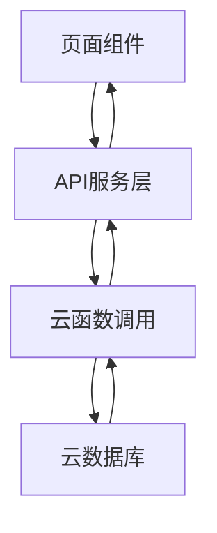

# 页面交互重构设计文档

## 1. 概述

本文档旨在设计StarBloom儿童积分奖励系统的页面交互重构方案，确保所有页面数据都从云函数获取，移除模拟代码，实现真正的数据驱动页面交互。

## 2. 设计原则

### 2.1 界面设计原则
- **主题色**: 绿色系 (#4CAF50)
- **操作按钮**: 统一放置在界面右上角
- **关闭按钮**: 位于右上角，采用简洁的纯文本样式，避免椭圆形背景
- **模板选择器**: 在添加任务/奖励页面，模板按钮位于表单上方，使用绿色边框
- **导航结构**: 底部Tab导航 + 页面内导航
- **内容布局**: 卡片式布局，清晰的视觉层次
- **交互反馈**: 及时的操作反馈和状态提示

### 2.2 技术实现原则
- 所有数据必须通过API服务层调用云函数获取
- 移除所有模拟数据和本地硬编码数据
- 使用统一数据管理器进行数据缓存和同步
- 遵循微信小程序开发规范

## 3. 页面架构设计

### 3.1 页面结构
```
StarBloom/
├── pages/
│   ├── index/              # 首页
│   ├── parent/             # 家长管理
│   ├── child/              # 儿童视图
│   ├── tasks/              # 任务管理
│   ├── rewards/            # 奖励商店
│   ├── points/             # 积分中心
│   ├── analysis/           # 数据分析
│   ├── settings/           # 系统设置
│   ├── dictionary/         # 字典配置
│   ├── templates/          # 预设模板
│   └── template-management/ # 模板管理
└── components/
    ├── child-card/         # 儿童卡片组件
    ├── task-item/          # 任务项组件
    ├── reward-item/        # 奖励项组件
    ├── stat-card/          # 统计卡片组件
    └── template-card/      # 模板卡片组件
```

### 3.2 数据流向


## 4. 核心页面交互设计

### 4.1 首页 (index)
#### 功能描述
- 展示用户信息和统计数据
- 提供快捷功能入口
- 显示儿童列表

#### 数据获取流程
1. 调用 `userApi.getCurrentUser()` 获取用户信息
2. 调用 `childrenApi.getList()` 获取儿童列表
3. 调用 `tasksApi.getList()` 和 `pointsApi.getStatistics()` 获取统计数据

#### 交互设计
- 页面加载时自动获取并展示数据
- 点击儿童卡片跳转到儿童详情页
- 点击快捷功能按钮跳转到对应功能页面

### 4.2 家长管理页 (parent)
#### 功能描述
- 儿童信息管理
- 云数据库初始化

#### 数据获取流程
1. 调用 `childrenApi.getList()` 获取儿童列表
2. 调用 `childrenApi.create()` 创建儿童信息
3. 调用 `childrenApi.update()` 更新儿童信息
4. 调用 `childrenApi.delete()` 删除儿童信息

#### 交互设计
- 页面加载时获取儿童列表并展示
- 提供添加、编辑、删除儿童的功能
- 提供云数据库初始化功能

### 4.3 任务管理页 (tasks)
#### 功能描述
- 任务列表展示
- 任务创建、编辑、删除
- 任务完成操作

#### 数据获取流程
1. 调用 `tasksApi.getList()` 获取任务列表
2. 调用 `tasksApi.create()` 创建任务
3. 调用 `tasksApi.update()` 更新任务
4. 调用 `tasksApi.delete()` 删除任务
5. 调用 `tasksApi.complete()` 完成任务

#### 交互设计
- 页面加载时获取任务列表并展示
- 提供任务筛选功能（按儿童、状态等）
- 提供任务完成操作
- 提供模板选择功能

### 4.4 奖励商店页 (rewards)
#### 功能描述
- 奖励列表展示
- 奖励创建、编辑、删除
- 奖励兑换操作

#### 数据获取流程
1. 调用 `rewardsApi.getList()` 获取奖励列表
2. 调用 `rewardsApi.create()` 创建奖励
3. 调用 `rewardsApi.update()` 更新奖励
4. 调用 `rewardsApi.delete()` 删除奖励
5. 调用 `exchangeApi.createExchange()` 兑换奖励

#### 交互设计
- 页面加载时获取奖励列表并展示
- 提供奖励筛选功能（按类型、积分等）
- 提供奖励兑换操作
- 提供模板选择功能

### 4.5 积分中心页 (points)
#### 功能描述
- 积分历史记录展示
- 积分统计信息展示

#### 数据获取流程
1. 调用 `pointsApi.getHistory()` 获取积分历史
2. 调用 `pointsApi.getBalance()` 获取积分余额
3. 调用 `pointsApi.getStatistics()` 获取积分统计

#### 交互设计
- 页面加载时获取积分数据并展示
- 提供积分记录筛选功能（按类型、时间等）
- 展示积分趋势图表

### 4.6 模板管理页 (template-management)
#### 功能描述
- 任务模板和奖励模板管理
- 模板创建、编辑、删除
- 模板导入导出

#### 数据获取流程
1. 调用 `templateManagementApi.getTaskTemplateList()` 获取任务模板列表
2. 调用 `templateManagementApi.getRewardTemplateList()` 获取奖励模板列表
3. 调用 `templateManagementApi.createTaskTemplate()` 创建任务模板
4. 调用 `templateManagementApi.updateTaskTemplate()` 更新任务模板
5. 调用 `templateManagementApi.deleteTaskTemplate()` 删除任务模板
6. 调用 `templateManagementApi.importTemplates()` 导入模板
7. 调用 `templateManagementApi.exportTemplates()` 导出模板

#### 交互设计
- 页面加载时获取模板列表并展示
- 提供模板分类切换功能
- 提供模板创建、编辑、删除功能
- 提供模板导入导出功能

## 5. 组件设计

### 5.1 儿童卡片组件 (child-card)
#### 功能描述
- 展示儿童基本信息
- 提供儿童操作入口

#### 数据获取
- 通过父页面传递儿童数据
- 不直接调用API

### 5.2 任务项组件 (task-item)
#### 功能描述
- 展示任务信息
- 提供任务操作入口

#### 数据获取
- 通过父页面传递任务数据
- 不直接调用API

### 5.3 奖励项组件 (reward-item)
#### 功能描述
- 展示奖励信息
- 提供奖励操作入口

#### 数据获取
- 通过父页面传递奖励数据
- 不直接调用API

### 5.4 模板卡片组件 (template-card)
#### 功能描述
- 展示模板信息
- 提供模板操作入口

#### 数据获取
- 通过父页面传递模板数据
- 不直接调用API

## 6. API服务层调用规范

### 6.1 调用方式
所有页面数据获取必须通过 `utils/api-services.js` 中定义的API服务层进行调用。

### 6.2 错误处理
- 所有API调用必须包含错误处理逻辑
- 网络错误时显示友好提示
- 数据加载失败时提供重试机制

### 6.3 加载状态
- 数据加载时显示加载提示
- 数据加载完成后隐藏加载提示
- 提供下拉刷新功能

## 7. 统一数据管理

### 7.1 数据缓存
使用 `utils/data-manager.js` 进行数据缓存，减少重复请求。

### 7.2 数据同步
- 页面激活时检查数据是否需要更新
- 关键数据变更时及时同步到缓存

## 8. 模板系统集成

### 8.1 模板选择器设计
```javascript
const templateSelectorConfig = {
  // 遵循用户偏好的绿色主题
  primaryColor: '#4CAF50',
  
  // 按钮布局：右上角位置
  templateButton: {
    position: 'top-right',
    style: 'green-border',
    text: '选择模板'
  },
  
  // 关闭按钮：简洁纯文本样式
  closeButton: {
    position: 'top-right',
    style: 'plain-text',
    text: '关闭',
    background: 'none'
  },
  
  // 模板列表布局
  templateList: {
    layout: 'card-grid',
    itemsPerRow: 2,
    spacing: '16rpx',
    cardStyle: {
      borderColor: '#E8F5E8',
      hoverColor: '#4CAF50'
    }
  }
}
```

### 8.2 模板选择交互流程
1. 点击"选择模板"按钮
2. 根据当前儿童年龄智能推荐模板
3. 浏览和预览模板
4. 应用模板到表单
5. 个性化修改后创建任务/奖励

## 9. 字典系统集成

### 9.1 字典数据获取
- 任务类型、奖励类型等字典数据通过 `dictionaryApi.getByCategory()` 获取
- 字典数据缓存在 `businessDataManager` 中

### 9.2 字典数据使用
- 下拉选择框使用字典数据填充
- 字典值在展示时转换为显示名称

## 10. 测试策略

### 10.1 单元测试
- 测试各页面的数据加载逻辑
- 测试组件的渲染逻辑

### 10.2 集成测试
- 测试API服务层与云函数的交互
- 测试页面与组件的集成

### 10.3 用户体验测试
- 测试页面加载性能
- 测试交互流畅性

## 11. 具体页面实现规范

### 11.1 首页实现规范
```javascript
// pages/index/index.js
Page({
  data: {
    userInfo: null,
    childrenList: [],
    stats: {
      totalPoints: 0,
      completedTasks: 0,
      activeChildren: 0
    },
    currentDate: ''
  },

  onLoad: function () {
    this.loadUserInfo();
    this.loadChildrenList();
    this.loadStats();
    this.setCurrentDate();
  },

  loadUserInfo: async function() {
    try {
      const result = await userApi.getCurrentUser();
      if (result.code === 0) {
        this.setData({ userInfo: result.data });
        // 缓存用户信息
        businessDataManager.setUserInfo(result.data);
      }
    } catch (error) {
      console.error('获取用户信息失败:', error);
      wx.showToast({ title: '获取用户信息失败', icon: 'none' });
    }
  },

  loadChildrenList: async function() {
    try {
      const result = await childrenApi.getList();
      if (result.code === 0) {
        this.setData({ childrenList: result.data });
        // 缓存儿童列表
        businessDataManager.setChildrenList(result.data);
      }
    } catch (error) {
      console.error('获取儿童列表失败:', error);
      wx.showToast({ title: '获取儿童列表失败', icon: 'none' });
    }
  },

  loadStats: async function() {
    try {
      // 获取统计数据的实现
      // 这里需要根据实际需求调用相应的API
    } catch (error) {
      console.error('获取统计数据失败:', error);
    }
  }
});
```

### 11.2 任务管理页实现规范
```javascript
// pages/tasks/tasks.js
Page({
  data: {
    taskList: [],
    loading: false,
    filters: {
      childId: '',
      status: ''
    }
  },

  onLoad: function () {
    this.loadTaskList();
  },

  loadTaskList: async function() {
    this.setData({ loading: true });
    try {
      const result = await tasksApi.getList(this.data.filters);
      if (result.code === 0) {
        this.setData({ taskList: result.data });
      }
    } catch (error) {
      console.error('获取任务列表失败:', error);
      wx.showToast({ title: '获取任务列表失败', icon: 'none' });
    } finally {
      this.setData({ loading: false });
    }
  },

  onRefresh: function() {
    this.loadTaskList();
  },

  onCompleteTask: async function(e) {
    const taskId = e.currentTarget.dataset.id;
    const childId = e.currentTarget.dataset.childId;
    
    try {
      const result = await tasksApi.complete(taskId, childId);
      if (result.code === 0) {
        wx.showToast({ title: '任务完成成功', icon: 'success' });
        // 重新加载任务列表
        this.loadTaskList();
      } else {
        wx.showToast({ title: result.msg, icon: 'none' });
      }
    } catch (error) {
      console.error('完成任务失败:', error);
      wx.showToast({ title: '完成任务失败', icon: 'none' });
    }
  }
});
```

### 11.3 奖励商店页实现规范
```javascript
// pages/rewards/rewards.js
Page({
  data: {
    rewardList: [],
    loading: false,
    filters: {
      status: 'active'
    }
  },

  onLoad: function () {
    this.loadRewardList();
  },

  loadRewardList: async function() {
    this.setData({ loading: true });
    try {
      const result = await rewardsApi.getList(this.data.filters);
      if (result.code === 0) {
        this.setData({ rewardList: result.data });
      }
    } catch (error) {
      console.error('获取奖励列表失败:', error);
      wx.showToast({ title: '获取奖励列表失败', icon: 'none' });
    } finally {
      this.setData({ loading: false });
    }
  },

  onExchangeReward: async function(e) {
    const rewardId = e.currentTarget.dataset.id;
    const currentChild = businessDataManager.getCurrentChild();
    
    if (!currentChild) {
      wx.showToast({ title: '请选择儿童', icon: 'none' });
      return;
    }
    
    try {
      const result = await exchangeApi.createExchange({
        rewardId: rewardId,
        childId: currentChild._id
      });
      
      if (result.code === 0) {
        wx.showToast({ title: '兑换申请已提交', icon: 'success' });
        // 重新加载奖励列表
        this.loadRewardList();
      } else {
        wx.showToast({ title: result.msg, icon: 'none' });
      }
    } catch (error) {
      console.error('兑换奖励失败:', error);
      wx.showToast({ title: '兑换奖励失败', icon: 'none' });
    }
  }
});
```

### 11.4 积分中心页实现规范
```javascript
// pages/points/points.js
Page({
  data: {
    pointHistory: [],
    balance: {
      totalPoints: 0,
      totalEarnedPoints: 0,
      totalConsumedPoints: 0
    },
    loading: false,
    filters: {
      changeType: ''
    }
  },

  onLoad: function () {
    const currentChild = businessDataManager.getCurrentChild();
    if (currentChild) {
      this.loadPointData(currentChild._id);
    }
  },

  loadPointData: async function(childId) {
    this.setData({ loading: true });
    try {
      // 获取积分余额
      const balanceResult = await pointsApi.getBalance(childId);
      if (balanceResult.code === 0) {
        this.setData({ balance: balanceResult.data });
      }
      
      // 获取积分历史
      const historyResult = await pointsApi.getHistory(childId, this.data.filters);
      if (historyResult.code === 0) {
        this.setData({ pointHistory: historyResult.data });
      }
    } catch (error) {
      console.error('获取积分数据失败:', error);
      wx.showToast({ title: '获取积分数据失败', icon: 'none' });
    } finally {
      this.setData({ loading: false });
    }
  }
});
```

### 11.5 模板管理页实现规范
```javascript
// pages/template-management/template-management.js
Page({
  data: {
    activeTab: 'task',
    taskTemplates: [],
    rewardTemplates: [],
    loading: false
  },

  onLoad: function () {
    this.loadTemplates();
  },

  loadTemplates: function() {
    if (this.data.activeTab === 'task') {
      this.loadTaskTemplates();
    } else {
      this.loadRewardTemplates();
    }
  },

  loadTaskTemplates: async function() {
    this.setData({ loading: true });
    try {
      const result = await templateManagementApi.getTaskTemplateList();
      if (result.code === 0) {
        this.setData({ taskTemplates: result.data });
      }
    } catch (error) {
      console.error('获取任务模板失败:', error);
      wx.showToast({ title: '获取任务模板失败', icon: 'none' });
    } finally {
      this.setData({ loading: false });
    }
  },

  loadRewardTemplates: async function() {
    this.setData({ loading: true });
    try {
      const result = await templateManagementApi.getRewardTemplateList();
      if (result.code === 0) {
        this.setData({ rewardTemplates: result.data });
      }
    } catch (error) {
      console.error('获取奖励模板失败:', error);
      wx.showToast({ title: '获取奖励模板失败', icon: 'none' });
    } finally {
      this.setData({ loading: false });
    }
  },

  onTabChange: function(e) {
    const tab = e.currentTarget.dataset.tab;
    this.setData({ activeTab: tab });
    this.loadTemplates();
  }
});
```

## 12. 组件实现规范

### 12.1 儿童卡片组件实现规范
```javascript
// components/child-card/child-card.js
Component({
  properties: {
    child: {
      type: Object,
      value: {}
    },
    showActions: {
      type: Boolean,
      value: true
    }
  },

  methods: {
    onTap: function() {
      this.triggerEvent('tap', this.data.child);
    },

    onEdit: function() {
      this.triggerEvent('edit', this.data.child);
    },

    onDelete: function() {
      this.triggerEvent('delete', this.data.child);
    }
  }
});
```

### 12.2 任务项组件实现规范
```javascript
// components/task-item/task-item.js
Component({
  properties: {
    task: {
      type: Object,
      value: {}
    }
  },

  methods: {
    onComplete: function() {
      this.triggerEvent('complete', { 
        id: this.data.task._id, 
        childId: this.data.task.childIds[0] 
      });
    },

    onEdit: function() {
      this.triggerEvent('edit', this.data.task);
    },

    onDelete: function() {
      this.triggerEvent('delete', this.data.task);
    }
  }
});
```

### 12.3 奖励项组件实现规范
```javascript
// components/reward-item/reward-item.js
Component({
  properties: {
    reward: {
      type: Object,
      value: {}
    }
  },

  methods: {
    onExchange: function() {
      this.triggerEvent('exchange', this.data.reward);
    },

    onEdit: function() {
      this.triggerEvent('edit', this.data.reward);
    },

    onDelete: function() {
      this.triggerEvent('delete', this.data.reward);
    }
  }
});
```

### 12.4 模板卡片组件实现规范
```javascript
// components/template-card/template-card.js
Component({
  properties: {
    template: {
      type: Object,
      value: {}
    },
    type: {
      type: String,
      value: 'task' // task or reward
    }
  },

  methods: {
    onApply: function() {
      this.triggerEvent('apply', { 
        template: this.data.template, 
        type: this.data.type 
      });
    },

    onPreview: function() {
      this.triggerEvent('preview', { 
        template: this.data.template, 
        type: this.data.type 
      });
    },

    onEdit: function() {
      this.triggerEvent('edit', { 
        template: this.data.template, 
        type: this.data.type 
      });
    },

    onDelete: function() {
      this.triggerEvent('delete', { 
        template: this.data.template, 
        type: this.data.type 
      });
    }
  }
});
```

## 13. 错误处理和加载状态规范

### 13.1 统一错误处理
所有API调用都应包含统一的错误处理逻辑：
```javascript
try {
  const result = await apiCall();
  if (result.code === 0) {
    // 处理成功响应
  } else {
    // 处理业务错误
    wx.showToast({ title: result.msg, icon: 'none' });
  }
} catch (error) {
  // 处理网络错误
  console.error('API调用失败:', error);
  wx.showToast({ title: '网络请求失败', icon: 'none' });
}
```

### 13.2 加载状态管理
所有异步操作都应有加载状态提示：
```javascript
// 开始加载
this.setData({ loading: true });

try {
  // 执行异步操作
} finally {
  // 结束加载
  this.setData({ loading: false });
}
```

## 14. 数据缓存策略

### 14.1 缓存实现
使用businessDataManager进行数据缓存：
```javascript
// 缓存数据
businessDataManager.setUserInfo(userInfo);

// 获取缓存数据
const cachedUserInfo = businessDataManager.getUserInfo();
```

### 14.2 缓存更新策略
- 页面加载时优先使用缓存数据，然后异步更新
- 关键数据变更时立即更新缓存
- 页面卸载时清理不必要的缓存

## 15. 性能优化建议

### 15.1 数据加载优化
- 使用分页加载大数据列表
- 对频繁访问的数据进行本地缓存
- 合并多个小请求为批量请求

### 15.2 网络请求优化
- 实现请求去重机制
- 设置合理的请求超时时间
- 对失败请求实现重试机制

### 15.3 内存管理优化
- 及时清理不需要的数据
- 合理使用图片压缩和懒加载
- 页面卸载时清理定时器和监听器

## 16. 安全性考虑

### 16.1 数据访问控制
- 所有云函数调用都应验证用户权限
- 前端只展示用户有权限访问的数据
- 敏感操作需要二次确认

### 16.2 输入验证
- 所有用户输入都应进行有效性验证
- 防止SQL注入和XSS攻击
- 对文件上传进行安全检查

## 17. 兼容性考虑

### 17.1 微信小程序版本兼容
- 使用context7工具验证API兼容性
- 避免使用过新或已废弃的API
- 对低版本基础库进行降级处理

### 17.2 设备兼容性
- 适配不同屏幕尺寸
- 考虑网络环境差异
- 处理不同设备性能差异

## 18. 可维护性设计

### 18.1 代码组织
- 遵循统一的目录结构
- 合理划分模块职责
- 保持代码简洁清晰

### 18.2 注释规范
- 关键业务逻辑添加详细注释
- 复杂算法说明设计思路
- 组件接口添加JSDoc注释

## 19. 部署和监控

### 19.1 部署流程
- 制定标准化部署流程
- 实现版本管理和回滚机制
- 进行部署前的自动化测试

### 19.2 监控和日志
- 记录关键操作日志
- 监控系统性能指标
- 设置异常告警机制