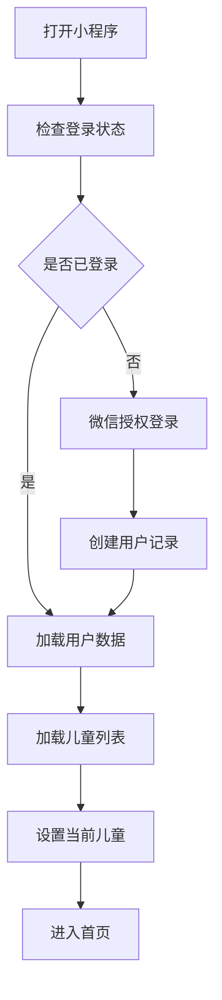
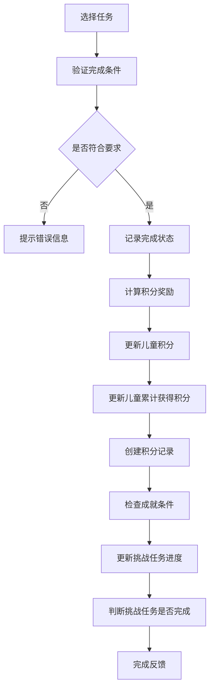
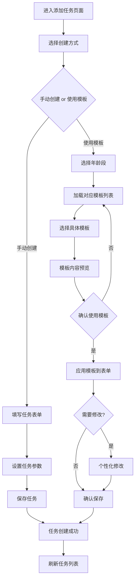
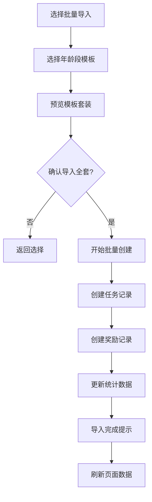
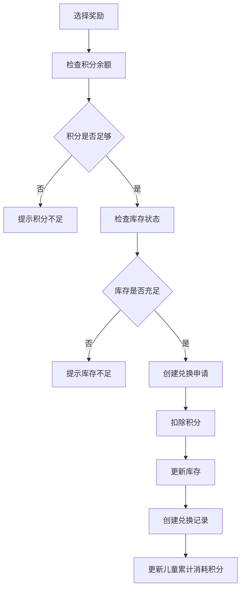

# StarBloom 儿童积分奖励系统 - 微信小程序设计文档

## 1. 概述

### 1.1 项目简介
StarBloom 是一个基于微信小程序的儿童行为激励管理系统，通过积分机制帮助家长培养儿童良好习惯，提供任务管理、积分奖励、数据分析等核心功能。

### 1.2 项目特色
- 🎯 **家长主导**：家长创建任务和奖励，引导儿童行为
- 🏆 **积分激励**：完成任务获得积分，积分兑换奖励
- 📊 **数据驱动**：完整的行为数据分析和趋势展示
- 🌈 **双视角**：家长管理视角 + 儿童游戏化视角
- ☁️ **云端同步**：基于微信云开发，数据实时同步

### 1.3 技术架构
- **前端**：微信小程序原生框架 (WXML/WXSS/JavaScript)
- **后端**：微信云开发 Serverless 架构
- **数据库**：微信云数据库 (NoSQL)
- **存储**：微信云存储 (图片、文件)
- **主题色**：绿色系 (#4CAF50)

## 2. 系统架构设计

### 2.1 前端架构
```
pages/
├── index/              # 首页
├── parent/             # 家长管理模块
│   ├── parent.js       # 家长控制面板
│   ├── addChild.js     # 添加儿童
│   ├── addTask.js      # 添加任务
│   └── addReward.js    # 添加奖励
├── child/              # 儿童视图模块
├── tasks/              # 任务管理模块
├── rewards/            # 奖励商店模块
├── points/             # 积分中心模块
├── analysis/           # 数据分析模块
├── settings/           # 设置模块
├── dictionary/         # 字典配置模块
└── templates/          # 预设模板模块

components/
├── task-item/          # 任务项组件
├── reward-item/        # 奖励项组件
├── child-card/         # 儿童卡片组件
├── stat-card/          # 统计卡片组件
└── template-card/      # 模板卡片组件

utils/
├── api-client.js       # API客户端
├── api-services.js     # API服务层
├── data-manager.js     # 数据管理器
└── util.js             # 工具函数
```

### 2.2 后端架构
```
cloudfunctions/
├── getUserInfo/         # 用户信息管理
├── manageChildren/      # 儿童信息管理
├── manageTasks/         # 任务管理
├── manageRewards/       # 奖励管理
├── managePoints/        # 积分系统管理
├── dataAnalysis/        # 数据分析
├── manageDictionary/    # 字典管理
├── manageTemplates/     # 预设模板管理
├── manageTemplateData/  # 模板数据管理
├── importExportTemplates/ # 模板导入导出功能
├── initDatabase/        # 数据库初始化
└── initDefaultRewards/  # 默认奖励初始化
```

### 2.3 数据库设计

#### 2.3.1 核心数据表结构

##### users - 用户信息表
```javascript
{
  _id: "string",              // 主键
  openid: "string",           // 微信用户唯一标识
  nickName: "string",         // 用户昵称
  avatarUrl: "string",        // 头像URL
  isAdmin: "boolean",         // 是否管理员
  isAdvancedUser: "boolean",  // 是否高级用户
  createTime: "date",         // 创建时间
  updateTime: "date"          // 更新时间
}
```

##### children - 儿童信息表
```javascript
{
  _id: "string",              // 主键
  name: "string",             // 儿童姓名
  age: "number",              // 年龄
  avatar: "string",           // 头像URL
  parentId: "string",         // 家长ID (外键 -> users.openid)
  totalPoints: "number",      // 当前总积分
  totalEarnedPoints: "number", // 累计获得积分
  totalConsumedPoints: "number", // 累计消耗积分
  createTime: "date",         // 创建时间
  updateTime: "date"          // 更新时间
}
```

##### tasks - 任务表
```javascript
{
  _id: "string",              // 主键
  name: "string",             // 任务名称
  description: "string",      // 任务描述
  points: "number",           // 基础积分
  taskType: "string",         // 任务类型：daily/weekly/monthly/once/challenge
  cycleType: "string",        // 任务周期类型：daily/weekly/monthly/custom
  status: "string",           // 状态：active/inactive
  parentId: "string",         // 创建者ID
  childIds: "array",          // 分配的儿童ID列表
  createTime: "date",         // 创建时间
  updateTime: "date"          // 更新时间
}
```

##### task_completion_records - 任务完成记录表
```javascript
{
  _id: "string",              // 主键
  taskId: "string",           // 任务ID
  childId: "string",          // 儿童ID
  completeDate: "date",       // 完成日期
  status: "string",           // 状态
  pointsEarned: "number",     // 获得的积分（冗余字段，便于查询）
  createBy: "string",         // 创建者（家长ID）
  createTime: "date",         // 创建时间
  updateTime: "date"          // 更新时间
}
```

##### rewards - 奖励表
```javascript
{
  _id: "string",              // 主键
  name: "string",             // 奖励名称
  description: "string",      // 奖励描述
  pointsRequired: "number",   // 所需积分
  rewardType: "string",       // 奖励类型：physical/privilege/experience/virtual/charity
  stock: "number",            // 库存数量
  status: "string",           // 状态
  parentId: "string",         // 创建者ID
  createTime: "date",         // 创建时间
  updateTime: "date"          // 更新时间
}
```

##### exchange_records - 兑换记录表
```javascript
{
  _id: "string",              // 主键
  rewardId: "string",         // 奖励ID
  childId: "string",          // 儿童ID
  pointsUsed: "number",       // 使用积分
  exchangeTime: "date",       // 兑换时间
  status: "string",           // 状态：pending/approved/delivered/cancelled
  parentId: "string",         // 家长ID
  _openid: "string",          // 兑换执行者openid
  createTime: "date"          // 创建时间
}
```

##### point_records - 积分记录表
```javascript
{
  _id: "string",              // 主键
  childId: "string",          // 儿童ID
  points: "number",           // 积分变动 (正数为获得，负数为消耗)
  changeType: "string",       // 变动类型：earn/consume/bonus/adjustment
  reason: "string",           // 变动原因
  sourceType: "string",       // 来源类型：task/exchange/adjustment
  recordTime: "date",         // 记录时间
  createTime: "date",         // 创建时间
  createBy: "string"          // 创建者openid
}
```

##### task_templates - 任务模板表
```javascript
{
  _id: "string",              // 主键
  templateId: "string",       // 模板唯一标识
  name: "string",             // 任务名称
  description: "string",      // 任务描述
  taskType: "string",         // 任务类型：daily/weekly/monthly/once/challenge
  cycleType: "string",        // 任务周期类型：daily/weekly/monthly/custom
  points: "number",           // 基础积分
  habitTags: "array",         // 习惯标签
  tips: "string",             // 温馨提示
  difficulty: "string",       // 难度等级：easy/medium/hard
  ageGroup: "string",         // 适用年龄段：grade1/grade2/grade3等
  ageRange: "object",         // 具体年龄范围 {min: 6, max: 8}
  category: "string",         // 分类：study/life/exercise/social/family
  challengeTarget: "object",  // 挑战目标配置（如果是挑战类型）
  challengeReward: "object",  // 挑战奖励配置
  isActive: "boolean",        // 是否启用
  sort_order: "number",       // 排序权重
  usage_count: "number",      // 使用次数统计
  version: "number",          // 模板版本号
  createBy: "string",         // 创建者（系统预设为'system'）
  createTime: "date",         // 创建时间
  updateTime: "date"          // 更新时间
}
```

##### dictionaries - 字典表
```javascript
{
  _id: "string",              // 主键
  category: "string",         // 字典分类
  code: "string",             // 字典编码
  name: "string",             // 显示名称
  value: "any",               // 字典值
  is_active: "boolean",       // 是否启用
  create_time: "date",        // 创建时间
  update_time: "date"         // 更新时间
}
```

## 3. 功能模块设计

### 3.1 首页模块 (index)
**路径**: `/pages/index/index`

#### 功能描述
- 用户微信授权登录
- 首页数据概览展示
- 快速导航到各功能模块
- 用户状态检查和数据初始化

#### 页面结构
```
- 顶部：用户信息区域（头像、昵称）
- 中部：儿童信息卡片（当前儿童积分、任务完成情况）
- 底部：功能导航入口（任务、奖励、积分、分析）
```

### 3.2 家长管理模块 (parent)

#### 3.2.1 家长控制面板 (`parent.js`)
**路径**: `/pages/parent/parent`

##### 功能描述
- 儿童信息管理和切换
- 数据统计概览
- 快速操作入口

##### 页面结构
```
- 顶部：儿童切换器
- 中部：数据统计卡片（今日任务、本周积分、累计积分）
- 底部：快捷操作按钮（添加任务、添加奖励、添加儿童）
```

#### 3.2.2 添加儿童 (`addChild.js`)
**路径**: `/pages/parent/addChild`

##### 功能描述
- 新增儿童信息
- 儿童资料编辑
- 头像上传管理

##### 页面结构
```
- 表单字段：
  - 儿童姓名（必填）
  - 年龄（必填）
  - 头像上传
- 操作按钮：保存、取消
```

#### 3.2.3 添加任务 (`addTask.js`)
**路径**: `/pages/parent/addTask`

##### 功能描述
- 创建各类型任务
- 任务规则配置
- 挑战任务设计
- 预设模板选择

##### 页面结构
```
- 顶部：模板选择按钮
- 表单字段：
  - 任务名称（必填）
  - 任务描述
  - 积分值（必填）
  - 任务类型（下拉选择）
  - 周期类型（下拉选择）
  - 适用儿童（多选）
  - 挑战目标（条件显示）
- 操作按钮：保存、取消
```

#### 3.2.4 添加奖励 (`addReward.js`)
**路径**: `/pages/parent/addReward`

##### 功能描述
- 创建奖励项目
- 奖励类型配置
- 兑换规则设置
- 预设模板选择

##### 页面结构
```
- 顶部：模板选择按钮
- 表单字段：
  - 奖励名称（必填）
  - 奖励描述
  - 所需积分（必填）
  - 奖励类型（下拉选择）
  - 库存数量
  - 兑换规则说明
- 操作按钮：保存、取消
```

### 3.3 儿童视图模块 (child)
**路径**: `/pages/child/child`

#### 功能描述
- 当前积分和任务状态
- 游戏化任务完成界面
- 奖励浏览和选择
- 成就展示和激励

#### 页面结构
```
- 顶部：儿童信息和积分展示
- 中部：今日任务列表（游戏化展示）
- 底部：奖励商店入口、成就展示
```

### 3.4 任务管理模块 (tasks)
**路径**: `/pages/tasks/tasks`

#### 功能描述
- 任务列表展示和筛选
- 任务完成状态管理
- 任务历史记录查看
- 挑战任务进度追踪

#### 页面结构
```
- 顶部：筛选器（按类型、状态、儿童）
- 中部：添加任务按钮
- 底部：任务列表（卡片式展示）
```

### 3.5 奖励商店模块 (rewards)
**路径**: `/pages/rewards/rewards`

#### 功能描述
- 奖励商店展示
- 按积分筛选可兑换奖励
- 奖励详情查看
- 兑换

#### 页面结构
```
- 顶部：积分余额展示、筛选器
- 中部：奖励列表（卡片式展示）
- 底部：兑换记录入口
```

### 3.6 积分中心模块 (points)
**路径**: `/pages/points/points`

#### 功能描述
- 积分变动历史
- 积分来源分析
- 收支统计图表
- 数据筛选和搜索

#### 页面结构
```
- 顶部：积分总览（当前积分、累计获得、累计消耗）
- 中部：积分变动记录列表
- 底部：图表展示（积分趋势、来源分布）
```

### 3.7 数据分析模块 (analysis)
**路径**: `/pages/analysis/analysis`

#### 功能描述
- 行为习惯分析
- 任务完成趋势
- 积分获得分析
- 成长报告生成

#### 页面结构
```
- 顶部：时间筛选器
- 中部：各类分析图表
  - 任务完成率趋势
  - 积分获取与消耗分析
  - 习惯养成分析
- 底部：生成报告按钮
```

### 3.8 设置模块 (settings)
**路径**: `/pages/settings/settings`

#### 功能描述
- 用户信息编辑
- 儿童切换管理
- 系统偏好设置
- 数据清理工具
- 字典配置管理

#### 页面结构
```
- 用户信息设置
- 儿童管理
- 系统设置
- 字典管理入口
- 数据清理工具
```

### 3.9 字典配置模块 (dictionary)
**路径**: `/pages/dictionary/dictionary`

#### 功能描述
- 统一字典数据配置和管理
- 任务类型配置
- 任务周期类型选项配置
- 奖励类型配置
- 积分变动类型配置
- 任务状态选项配置
- 兑换状态选项配置
- 自定义标签和分类管理
- 字典项的增删改查功能

### 3.10 预设模板模块 (templates)
**路径**: `/pages/templates/templates`

#### 功能描述
- 提供适合不同年龄段儿童的预设任务和奖励模板
- 6岁一年级儿童模板
- 模板使用功能

#### 页面结构
```
- 顶部：年龄段选择
- 中部：模板分类导航
- 底部：模板列表展示
```

### 3.11 模板管理模块 (template-management)
**路径**: `/pages/template-management/template-management`

#### 功能描述
- 专门用于维护任务模板和兑换奖励模板的管理页面
- 供高级用户和系统管理员使用

#### 页面结构
```
- 模板分类管理
- 模板列表展示和筛选
- 模板状态管理
- 模板使用统计查看
- 模板导入导出功能
```

## 4. 核心业务流程

### 4.1 用户认证流程


### 4.2 任务完成流程


### 4.3 添加任务业务流程（含预设模板）


### 4.4 批量导入模板流程


### 4.5 奖励兑换机制


## 5. 界面设计规范

### 5.1 设计主题
- **主题色**: 绿色系 (#4CAF50)
- **辅助色**: 淡绿色 (#81C784), 深绿色 (#388E3C)
- **强调色**: 橙色 (#FF9800), 红色 (#F44336)
- **中性色**: 灰色系列 (#757575, #BDBDBD, #F5F5F5)

### 5.2 界面布局原则
- **导航结构**: 底部Tab导航 + 页面内导航
- **内容布局**: 卡片式布局，清晰的视觉层次
- **交互反馈**: 及时的操作反馈和状态提示


## 6. 技术实现要点

### 6.1 统一数据管理架构
```javascript
// 数据管理层 (data-manager.js)
const businessDataManager = {
  // 用户信息管理
  setUserInfo(), getUserInfo(),
  
  // 儿童信息管理
  setCurrentChild(), getCurrentChild(), 
  setChildrenList(), getChildrenList(),
  
  // 缓存和同步
  syncFromGlobalData(), clearAll()
}
```

### 6.2 云函数设计模式
```javascript
// 云函数统一结构
exports.main = async (event, context) => {
  const wxContext = cloud.getWXContext()
  const { action, data } = event
  
  try {
    switch (action) {
      case 'list': return await listItems(data)
      case 'create': return await createItem(data, wxContext.OPENID)
      case 'update': return await updateItem(data)
      case 'delete': return await deleteItem(data)
      default: return { code: -1, message: '未知操作' }
    }
  } catch (error) {
    return handleError(action, error)
  }
}
```


## 7. 性能优化策略

### 7.1 数据加载优化
- **分页加载**: 大数据量采用分页机制
- **缓存策略**: 热点数据本地缓存
- **预加载**: 关键数据提前加载
- **懒加载**: 非关键数据按需加载

### 7.2 网络请求优化
- **并发请求**: 多个独立请求并行执行
- **请求去重**: 防止重复请求同一接口
- **超时处理**: 设置合理的请求超时时间
- **重试机制**: 失败请求自动重试

### 7.3 内存管理优化
- **数据清理**: 及时清理不需要的数据
- **图片优化**: 合理的图片尺寸和格式
- **组件销毁**: 页面卸载时清理资源

## 8. 安全性设计

### 8.1 数据安全
- **访问控制**: 严格的数据访问权限
- **输入验证**: 所有用户输入严格验证
- **敏感数据加密**: 重要信息加密存储

### 8.2 接口安全
- **权限验证**: 每个接口调用验证用户权限
- **参数校验**: 严格验证接口参数
- **频率限制**: 防止接口被恶意调用

### 8.3 业务安全
- **操作审计**: 记录关键操作日志
- **异常监控**: 监控异常操作行为
- **数据备份**: 定期备份重要数据

## 9. 部署和维护

### 9.1 开发环境配置
- **云环境ID**: 配置微信云开发环境
- **云函数部署**: 批量部署所有云函数
- **数据库初始化**: 创建集合和索引
- **权限配置**: 设置数据库访问权限

### 9.2 生产环境部署
- **版本管理**: 使用版本控制管理代码
- **发布流程**: 标准化发布流程
- **回滚机制**: 问题版本快速回滚
- **监控告警**: 系统状态实时监控

### 9.3 运维监控
- **性能监控**: 关键指标实时监控
- **错误监控**: 异常情况及时告警
- **用户行为**: 用户使用情况分析
- **数据统计**: 业务数据定期统计

## 10. 开发规范

### 10.1 代码规范
- **代码质量**: 使用context7 mcp工具获取最新的小程序和版本相符合的api接口，防止使用了微信小程序不支持的api和方法
- **代码风格**: 统一的代码风格
- **命名规范**: 统一的变量和函数命名
- **注释规范**: 完整的代码注释
- **格式规范**: 一致的代码格式
- **ES6语法**: 使用现代JavaScript语法，wxml文件中绑定属性不要使用方法名绑定方法的返回值

### 10.2 组件规范
- **组件化开发**: 可复用的组件设计
- **状态管理**: 统一的状态管理模式
- **事件处理**: 标准化事件处理机制
- **样式管理**: 模块化样式管理

### 10.3 测试规范
- **单元测试**: 关键函数单元测试
- **集成测试**: 模块间集成测试
- **用户测试**: 用户体验测试
- **性能测试**: 性能指标测试

## 11. 项目文件结构

```javascript
KidStars/
├── app.js                          // 应用入口文件
├── app.json                        // 应用配置文件
├── app.wxss                        // 全局样式文件
├── pages/                          // 页面目录
│   ├── index/                      // 首页
│   ├── parent/                     // 家长管理
│   │   ├── parent.js               // 家长控制面板
│   │   ├── addChild.js             // 添加儿童
│   │   ├── addTask.js              // 添加任务
│   │   └── addReward.js            // 添加奖励
│   ├── child/                      // 儿童视图
│   ├── tasks/                      // 任务管理
│   ├── rewards/                    // 奖励商店
│   ├── points/                     // 积分中心
│   ├── analysis/                   // 数据分析
│   ├── settings/                   // 系统设置
│   ├── dictionary/                 // 字典配置管理
│   └── templates/                  // 预设模板管理
├── utils/                          // 工具类目录
│   ├── api-client.js               // API客户端
│   ├── api-services.js             // API服务层
│   └── data-manager.js             // 数据管理器
├── cloudfunctions/                 // 云函数目录
│   ├── getUserInfo/                // 用户信息管理
│   ├── manageChildren/             // 儿童信息管理
│   ├── manageTasks/                // 任务管理
│   ├── manageRewards/              // 奖励管理
│   ├── managePoints/               // 积分系统管理
│   ├── dataAnalysis/               // 数据分析
│   ├── manageDictionary/           // 字典管理
│   ├── manageTemplates/            // 预设模板管理
│   ├── manageTemplateData/         // 模板数据管理
│   ├── importExportTemplates/      // 模板导入导出功能
│   └── ...                         // 其他云函数
├── components/                     // 自定义组件
├── images/                         // 图片资源
└── scripts/                        // 脚本工具
```

## 12. 总结

这个设计文档涵盖了StarBloom儿童积分奖励系统的完整设计，包括：

1. **系统架构设计** - 前后端分离架构，基于微信云开发
2. **数据库设计** - 12张核心数据表，覆盖所有业务数据
3. **功能模块划分** - 11个主要功能模块，每个模块职责清晰
4. **核心业务流程** - 用户认证、任务完成、奖励兑换等关键流程
5. **界面设计规范** - 统一的设计风格和交互规范
6. **技术实现要点** - 关键技术方案和最佳实践
7. **性能和安全** - 优化策略和安全保障措施
8. **部署维护** - 完整的部署和运维方案

该文档可作为开发团队的技术参考，确保在架构设计、功能实现、性能优化等方面都有清晰的指导。通过遵循此设计文档，开发团队可以高效地构建出符合需求的StarBloom儿童积分奖励系统，为家长和儿童提供优质的使用体验。